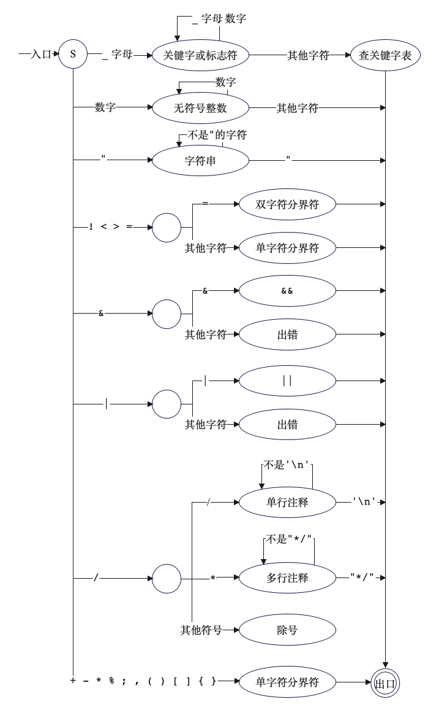
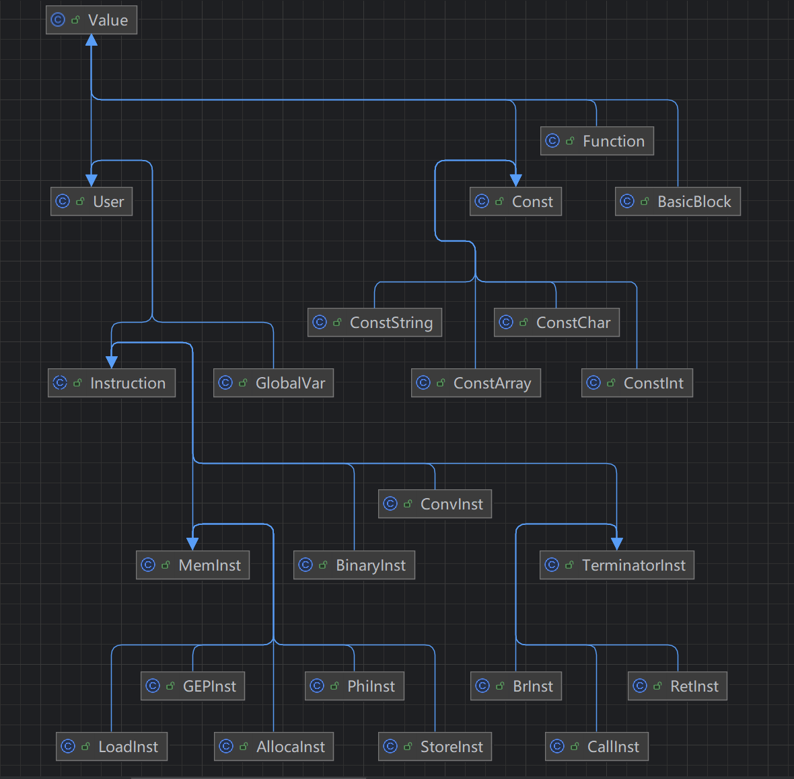

# 2024编译器设计文档

> 22373407  王飞阳

## 一、参考编译器介绍

在开始自己设计编译器之前，我的编译器主要参考的编译器为Pascal编译器，具体如下。

### 1. 总体结构

从总体上来说，Pascal编译器的结构为经典的词法分析、语法分析、错误处理、语义分析、代码生成和代码优化六个部分。

### 2. 接口设计

#### 2.1 `nextch`读取下一个字符

```pascal
procedure nextch;  { read next character; process line end }
  begin
    if cc = ll {* 如果读到了当前行行尾 *}
    then begin
           if eof( psin ) {* 要读入的文件已经读完 *}
           then begin
                  writeln( psout ); {* 输出空行 *}
                  writeln( psout, 'program incomplete' ); {* 输出'program incomplete' *}
                  errormsg; {* 输出错误信息 *}
                  exit;
                end;
           if errpos <> 0 {* errpos不等于0，有错误出现 *}
           then begin
                  if skipflag then endskip; {* 调用endskip过程加下划线 *}
                  writeln( psout );
                  errpos := 0
                end;
           write( psout, lc: 5, ' '); {* 没有错误执行的操作，在list文件中输出当前PCODE的行号以及一个空格，不换。lc:5表示输出长度大于等于5,不足5前面用空格补齐*}
           ll := 0; {* 将行长度和字符指针置零 *}
           cc := 0;
           while not eoln( psin ) do {* 因为在读字符之前当前行已经读完了，所以psin的指针指向的是下一行代码,于是进行循环将psin所在行的代码装入line中。循环读字符直到读到行末，能进入此循环说明之前处理了错误或进入新行 *}
             begin
               ll := ll + 1; {* 统计当前行长度 *}
               read( psin, ch ); {* 读入一个字符 *}
               write( psout, ch ); {* 输出该字符 *}
               line[ll] := ch {* 将ch保存到line中,循环结束line保存到当前行末的所有字符 *}
             end;
           ll := ll + 1;
           readln( psin ); {* 从psin读一行空行，让psin指向下一行代码 *}
           line[ll] := ' '; {* 将行末置为空格 *}
           writeln( psout );
         end;
    cc := cc + 1; {* 字符指针后移 *}
    ch := line[cc]; {* 读取下一个字符，ch = 取出来的字符 *}
  end { nextch };
```

#### 2.2 `error`打印错误信息

```pascal
{* 打印出错位置和错误编号，并将错误编号加入errs中 *}
procedure error( n: integer ); {* n为错误号 *}
begin
  if errpos = 0
  then write ( psout, '****' );
  if cc > errpos {* 确认字符计数指针在当前errpos之后，避免重复报错 *}
  then begin
         write( psout, ' ': cc-errpos, '^', n:2);
         errpos := cc + 3;
         errs := errs +[n] {* 将错误号加入errs集合 *}
       end
end { error };
```

#### 2.3 `adjustscale`处理实数

```pascal
{* 根据小数位数和指数大小求出实数尾部值的大小，并附在rnum后面得到最后的实数 *}
  procedure adjustscale;
    var s : integer;
        d, t : real;
    begin
      if k + e > emax {* 当前位数加上指数超过指数上限则报错 *}
      then error(21)
      else if k + e < emin {* 低于最小值则直接将实数设置为0 *}
      then rnum := 0
      else begin
        s := abs(e); {* 将指数转为正数方便处理 *}
        t := 1.0; {* 指数部分转换后的结果 *}
        d := 10.0; {* 底数 *}
        repeat {* 将实数的指数部分变为普通数字 *}
          while not odd(s) do {* 循环处理偶次幂直到指数为奇数 *}
            begin
              s := s div 2; {* 指数除以二 *}
              d := sqr(d) {* 把平方直接转到d上，d = d的平方 *}
            end;
          s := s - 1;
          t := d * t
        until s = 0;
        if e >= 0 {* 判断指数正负，决定是该除以t还是乘以t。把指数e转换成2N+1或者2N的形式, t此时为10的e次方*}
        then rnum := rnum * t
        else rnum := rnum / t
      end
    end { adjustscale };
```

#### 2.4 `enter`登记符号表

```pascal
{* 把标准类型、过程、函数名登到符号表(tab)中。
x0为标识符名，x1为标识符种类，x2为标识符类型，x3为地址或大小（大小只针对类型） *}
procedure enter(x0:alfa; x1:objecttyp; x2:types; x3:integer );
  begin
    t := t + 1;    { enter standard identifier }
    with tab[t] do
      begin
        name := x0;
        link := t - 1;
        obj := x1;
        typ := x2;
        ref := 0;
        normal := true;
        lev := 0; {*主程序开始之前就登录了一些自带的,所以级别最高*}
        adr := x3;
      end
  end; { enter }
```

#### 2.5 `enterarray`登记数组符号表

```pascal
{* 将数组下标信息录入数组表atab，
tp为数组下标类型，可为ints,bools或者chars
l,h分别为数组下上界 *}
procedure enterarray( tp: types; l,h: integer );
  begin
    if l > h {* 界限出错 *}
    then error(27);
    if( abs(l) > xmax ) or ( abs(h) > xmax ) {* 超范围下标，报错 *}
    then begin
           error(27);
           l := 0;
           h := 0;
         end;
    if a = amax {* 数组表已满，报错 *}
    then fatal(4)
    else begin
           a := a + 1;
           with atab[a] do {* 正常设置数组的三个域 *}
             begin
               inxtyp := tp;
               low := l;
               high := h
             end
         end
  end { enterarray };
```

#### 2.6 `enterreal`登记实常量表

```pascal
{* 录入实常量表rconst *}
procedure enterreal( x: real );
  begin
    if c2 = c2max - 1
    then fatal(3)
    else begin
           rconst[c2+1] := x;
           c1 := 1; {*循环用的局部变量*}
           while rconst[c1] <> x do
             c1 := c1 + 1;
           if c1 > c2
           then  c2 := c1 {*如果在c2之前就有该常量,则c1<=c2,于是c2不更新,否则c2更新*}
         end
  end { enterreal };
```

#### 2.7 `enterblock`登记分程序信息入分程序表

```pascal
{* 将分程序信息录入分程序表btab *}
procedure enterblock;
  begin
    if b = bmax {* 分程序表满了 *}
    then fatal(2)
    else begin
           b := b + 1;
           btab[b].last := 0; {* 指向过程或函数最后一个符号在表中的位置,建表用 *}
           btab[b].lastpar := 0; {* 指向过程或者函数的最后一个'参数'符号在tab中的位置,退栈用 *}
         end
  end { enterblock };
```

#### 2.8 `emit`生成中间代码PCODE

```pascal
{* emit和下面两个过程都是用来生成PCODE的，后个过程接的参数是操作数
fct为操作码 *}
procedure emit( fct: integer ); {*这几个emit是用来生成pcode的,fct为操作码,这里为无操作数*}
  begin
    if lc = cmax   {*lc为code表的索引变量*}
    then fatal(6);
    code[lc].f := fct;
    lc := lc + 1
  end { emit };

procedure emit1( fct, b: integer );  {*一个操作数*}
  begin
    if lc = cmax
    then fatal(6);
    with code[lc] do
      begin
        f := fct;
        y := b;
      end;
    lc := lc + 1
  end { emit1 };

procedure emit2( fct, a, b: integer );  {*两个操作数*}
  begin
    if lc = cmax then fatal(6);
    with code[lc] do
      begin
        f := fct;
        x := a;
        y := b
      end;
    lc := lc + 1;
  end { emit2 };
```

#### 2.9 `test`检查符号合法性

```pascal
  {* 检查当前sym是否合法,若不合法,打印出错标志并进行跳读 *}
  procedure test( s1,s2: symset; n:integer );
    begin
      if not( sy in s1 )
      then skip( s1 + s2, n )
    end { test };
  {* 检查分号是否合法 *}
  procedure testsemicolon;
    begin
      if sy = semicolon
      then insymbol
      else begin
             error(14);
             if sy in [comma, colon]
             then insymbol
           end;
      test( [ident] + blockbegsys, fsys, 6 )
    end { testsemicolon };
```

#### 2.10 `enter`登记符号表

```pascal
  {* 在分程序中将标识符id填入tab,k为标识符种类 *}
  procedure enter( id: alfa; k:objecttyp );
    var j,l : integer;
    begin
      if t = tmax {* tab已满，报错 *}
      then fatal(1)
      else begin
             tab[0].name := id;
             j := btab[display[level]].last; {* 得到对应level的分程序的最后一个标识符位置 *}
             l := j;
             while tab[j].name <> id do {* 从分程序尾部一直向前遍历，看是否存在与id重名的标识符 *}
               j := tab[j].link;
             if j <> 0 {* 有重名则报错。已经在符号表中有记载了,重复定义 *}
             then error(1)
             else begin {* 不重名则正常入栈 。在tab中登记信息*}
                    t := t + 1;
                    with tab[t] do
                      begin
                        name := id;
                        link := l;
                        obj := k;
                        typ := notyp;
                        ref := 0;
                        lev := level;
                        adr := 0;
                        normal := false { initial value }
                      end;
                    btab[display[level]].last := t{*更新当前分程序层最后一个标识符在tab表中的位置*}
                  end
           end
    end { enter };

  {* 查找分程序中标识符id在符号表中位置并返回 *}
  function loc( id: alfa ):integer;
    var i,j : integer;        { locate if in table }
    begin
      i := level; {*i为当前分程序层*}
      tab[0].name := id;  { sentinel }
      repeat
        j := btab[display[i]].last;
        while tab[j].name <> id do
        j := tab[j].link;
        i := i - 1;
      until ( i < 0 ) or ( j <> 0 );{*当前层没有则往前再找一层,直到找到(j<>0)或者没有(i<0)*}
      if j = 0
      then error(0);{*没找到,报错*}
      loc := j
    end { loc } ;

  {* 将变量加入到tab，若sy不是标识符则报错 *}
  procedure entervariable;
    begin
      if sy = ident
      then begin
             enter( id, vvariable );
             insymbol
           end
      else error(2)
    end { entervariable };
```

#### 2.11 `constant`处理常量

```pascal
{* 处理分程序中常量，由c返回常量的类型与值 *}
  procedure constant( fsys: symset; var c: conrec );
    var x, sign : integer;
    begin
      c.tp := notyp;
      c.i := 0;
      test( constbegsys, fsys, 50 );
      if sy in constbegsys {* 如果sy是常量开始的符号,才往下继续分析 *}
      then begin
             if sy = charcon
             then begin {* sy是字符常量 *}
                    c.tp := chars;
                    c.i := inum; {* inum存储该字符的ascii码值 *}
                    insymbol
                  end
             else begin
                  sign := 1; {* sy不是字符常量,默认符号为正 *}
                  if sy in [plus, minus] {* sy是正负号 *}
                  then begin
                         if sy = minus {*是负号*}
                         then sign := -1;
                         insymbol
                       end;
                  if sy = ident {* sy是标识符常量 *}
                  then begin
                         x := loc(id); {* 找到id在表中位置 *}
                         if x <> 0
                         then
                           if tab[x].obj <> konstant {* id对应符号种类不是常量，报错 *}
                           then error(25)
                           else begin {* 得到的tab[x]为标识符常量，对c进行相应处理 *}
                                  c.tp := tab[x].typ; {* 得到类型 *}
                                  if c.tp = reals {* 根据类型是整数还是实数进行处理 *}
                                  then c.r := sign*rconst[tab[x].adr]
                                  else c.i := sign*tab[x].adr
                                end;
                         insymbol
                       end
                  else if sy = intcon {* sy是整数常量 *}
                       then begin
                              c.tp := ints;
                              c.i := sign*inum; {* 在i域中存入带符号的整数值 *}
                              insymbol
                            end
                 else if sy = realcon {* sy是实数常量 *}
                      then begin
                             c.tp := reals;
                             c.r := sign*rnum; {* 在r域中存入带符号的整数值 *}
                             insymbol
                           end
                 else skip(fsys,50) {* sy不是任何类型常量，报错并跳过部分代码 *}
                end;
                test(fsys,[],6)
           end
    end { constant };
```

#### 2.12 `typ`处理类型

```pascal
  {* 处理类型说明,返回当前关键词的类型tp,在符号表中的位置rf,以及需要占用存储空间的大小sz *}
  procedure typ( fsys: symset; var tp: types; var rf,sz:integer );
    var eltp : types;
        elrf, x : integer;
        elsz, offset, t0, t1 : integer;

    {* 数组类型的处理比较特殊，做单独处理.登录数组类型到atab并返回数组的登录位置和数组大小 *}
    procedure arraytyp( var aref, arsz: integer );
      var eltp : types; {* 数组元素类型 *}
          low, high : conrec; {* 上下界 *}
          elrf, elsz: integer; {* 记录ref和size方便返回 *}
      begin
        constant( [colon, rbrack, rparent, ofsy] + fsys, low ); {* 获得数组编号下界 *}
        if low.tp = reals {* 下标类型不是整数，报错并切换为整数，数值为0}
        then begin
               error(27);
               low.tp := ints;
               low.i := 0
             end;
        if sy = colon {* 下一个符号是..或者:都可继续执行 *}
        then insymbol
        else error(13);
        constant( [rbrack, comma, rparent, ofsy ] + fsys, high ); {* 获得数组编号上界 *}
        if high.tp <> low.tp {* 上下界需保持类型一致，否则报错，并将上界大小调为与下界一致 *}
        then begin
               error(27);
               high.i := low.i
             end;
        enterarray( low.tp, low.i, high.i ); {* 将数组下标信息录入atab *}
        aref := a; {* 将数组在atab中的位置存在aref中 *}
        if sy = comma
        then begin {* 若读到逗号，说明需要建立多维数组 *}
               insymbol;
               eltp := arrays; {* 数组元素类型为arrays *}
               arraytyp( elrf, elsz ) {* 递归处理数组内的数组 *}
             end
        else begin {* 不是逗号的情况（右方括号或非法） *}
               if sy = rbrack {* 读到右方括号，说明数组下标部分声明完毕 *}
               then insymbol
               else begin {* 非法 *}
                      error(12);
                      if sy = rparent {* 若为右大括号则容错 *}
                      then insymbol
                    end;
               if sy = ofsy {* 读到of关键字则继续，否则报错 *}
               then insymbol
               else error(8);
               typ( fsys, eltp, elrf, elsz ) {* 处理数组元素的类型 *}
             end;
        with atab[aref] do {* 处理完多维数组或数组元素信息则将这些信息存入atab[aref]中}
          begin
            arsz := (high-low+1) * elsz;
            size := arsz;
            eltyp := eltp;
            elref := elrf;
            elsize := elsz
          end
      end { arraytyp };
    begin { typ  }
      tp := notyp;
      rf := 0;
      sz := 0;
      test( typebegsys, fsys, 10 ); {* 检查当前符号是否为类型声明的开始符 *}
      if sy in typebegsys {* 如果是类型声明的开始符 *}
      then begin
              if sy = ident {* 当前符号为标识符 *}
              then begin
                    x := loc(id); {* 查找id在符号表中的位置 *}
                    if x <> 0
                    then with tab[x] do
                           if obj <> typel {* 符号表中标识符种类不是类型标识符(typel)（非用户定义或编译器自带），报错 *}
                           then error(29)
                           else begin {* 正常获取符号类型 *}
                                  tp := typ;
                                  rf := ref;
                                  sz := adr;{*获得其在运行栈中分配的存储空间*}
                                  if tp = notyp {* 未定义类型，报错 *}
                                  then error(30)
                                end;
                    insymbol
                  end
              else if sy = arraysy {* 当前符号为array关键字 *}
              then begin
                    insymbol;
                    if sy = lbrack {* 当前符号为[，则处理下一符号}
                    then insymbol
                    else begin {* 否则报错并容错( *}
                          error(11);
                          if sy = lparent 
                          then insymbol
                         end;
                    tp := arrays; {*类型为数组类型*}
                    arraytyp(rf,sz) {*登录数组类型*}
                   end
             else begin { records } {* 不是标识符也不是数组类型，则只可能为记录 *}
                    insymbol;
                    enterblock; {* 记录被看做一个分程序，故需在btab中记录它的信息 *}
                    tp := records;
                    rf := b; {* rf指向btab中记录的位置 *}
                    if level = lmax
                    then fatal(5);{* 当前嵌套层次已经是最大层次了,即不能产生更深的嵌套，报错并终止程序 *}
                    level := level + 1;
                    display[level] := b; {* 建立分层次索引 *}
                    offset := 0;
                    while not ( sy in fsys - [semicolon,comma,ident]+ [endsy] ) do
                      {* end之前都是记录类型变量内的变量声明 *}
                      begin { field section } {* 处理记录内部成员变量 *}
                        if sy = ident
                        then begin {* 当前符号为标识符 *}
                                t0 := t; {* 将当前tab指针存入t0 *}
                                entervariable; {* 变量表 *}
                                while sy = comma do {* 同类型变量同时申明，
                                通过逗号分隔,未遇到冒号则继续读入并入表 *}
                                  begin
                                    insymbol;
                                    entervariable
                                  end;
                                if sy = colon
                                then insymbol{* 遇到了冒号,说明这类的变量声明结束了,冒号后面跟变量的类型 *}
                                else error(5);
                                t1 := t; {* 将当前tab指针存入t1 *}
                                typ( fsys + [semicolon, endsy, comma,ident], eltp, elrf, elsz );
                                {* 递归调用typ来处理记录类型的成员变量,确定各成员的类型,ref和adr *}
                                while t0 < t1 do {* 填写t0到t1中信息缺失的部分,
                                由于t0~t1都是同一类型的变量,因此size大小是相同 *}
                                begin
                                  t0 := t0 + 1;
                                  with tab[t0] do {* 用获取到的成员变量信息补充表项内容 *}
                                    begin
                                      typ := eltp;{*eltp来自上面的typ递归调用*}
                                      ref := elrf; {* 此处ref为记录在btab中的位置 *}
                                      normal := true;{*所有normal的初值都为false*}
                                      adr := offset; {* 变量地址位移 *}
                                      offset := offset + elsz {* 下一变量真实位置 *}
                                    end
                                end
                             end; { sy = ident }
                        if sy <> endsy
                        then begin {* 当前符号不是end *}
                               if sy = semicolon
                               then insymbol {* 若为分号，则正常读取后续符号 *}
                               else begin {* 否则报错并容错，容逗号 *}
                                      error(14);
                                      if sy = comma
                                      then insymbol
                                    end;
                                    test( [ident,endsy, semicolon],fsys,6 )
                                    {* 检测当前符号是否合法。开启下一行处理时检验当前符号是否合法*}
                             end
                      end; { field section }
                    btab[rf].vsize := offset; {* vsize为记录所需存储单元数目 *}
                    sz := offset;
                    btab[rf].psize := 0; {* 记录存储单元不需要psize。该程序块的参数占用空间为0,因为record类型并不是真正的过程,没有参数 *}
                    insymbol;
                    level := level - 1{*record处理结束后level降一层*}
                  end; { record }
             test( fsys, [],6 ) {*检查当前sym是否合法*}
           end;
      end { typ };
```

#### 2.13 `parameterlist`处理形参

```pascal
  {* 处理过程或函数说明中的形参，将形参信息填入符号表 *}
  procedure parameterlist; { formal parameter list  }
    var tp : types;
        valpar : boolean; {* value parameter *}
        rf, sz, x, t0 : integer;
    begin
      insymbol;
      tp := notyp;
      rf := 0;{*初始化符号表的位置*}
      sz := 0; {*初始化元素的大小*}
      test( [ident, varsy], fsys+[rparent], 7 );
      while sy in [ident, varsy] do {* 处理所有是标识符或var关键字的形参 *}
        begin
          if sy <> varsy {* 不是var（指针）参数，将valpar设置为true *}
          then valpar := true {*值形参*}
          else begin {* 是指针参数，将valpar设置为false *}
                 insymbol;
                 valpar := false
               end;
          t0 := t; {* 存第一个参数在tab中地址到t0 *}
          entervariable;
          while sy = comma do {* 循环给多个同类型参数入表 *}
            begin
              insymbol;
              entervariable;
            end;

          {* 以下代码与typ处理记录同类成员变量的代码近似，只做不同部分的分析 *}
          if sy = colon{*等于冒号则开始处理类型*}
          then begin
                  insymbol;
                  if sy <> ident {* 非标识符一定不是数据类型，报错 *}
                  then error(2)
                  else begin
                         x := loc(id);
                         insymbol;
                         if x <> 0 
                         then with tab[x] do
                           if obj <> typel {*是标识符中的类型*}
                           then error(29)
                           else begin
                                  tp := typ;
                                  rf := ref;
                                  if valpar {* 值形参。针对指针参数与值参数对sz做不同处理 *}
                                    then sz := adr {*获得当前形参在符号表的位置*}
                                    else sz := 1 {*不是值形参则将其置为1(在这篇代码中,变量形参的大小都设置为了1)*}
                                end;
                       end;
                  test( [semicolon, rparent], [comma,ident]+fsys, 14 )
                 end
          else error(5); {* 不是冒号则报错（不支持数据类型的自动解释） *}
          while t0 < t do
            begin
              t0 := t0 + 1;
              with tab[t0] do
                begin
                  typ := tp;
                  ref := rf; {* ref = 0 *}
                  adr := dx; {* adr = 运行栈中存储分配单元的相对地址dx *}
                  lev := level;
                  normal := valpar;
                  dx := dx + sz{*block中的变量存储索引更新*}
                end
            end;
            if sy <> rparent {* 不是右括号代表还有参数或出错 *}
            then begin
                   if sy = semicolon
                   then insymbol
                   else begin
                          error(14);
                          if sy = comma
                          then insymbol
                        end;
                        test( [ident, varsy],[rparent]+fsys,6)
                 end
        end { while };
      if sy = rparent {* 参数声明结束后应当用右括号结尾 *}
      then begin
             insymbol;
             test( [semicolon, colon],fsys,6 )
           end
      else error(4)
    end { parameterlist };
```

#### 2.14 `typedeclaration`处理自定义类型

```pascal
  {* 处理类型自定义，将自定义的类型信息填入tab，与constdec过程几乎一样 *}
  procedure typedeclaration;
    var tp: types;
        rf, sz, t1 : integer;
    begin
      insymbol;
      test([ident], blockbegsys,2 );{*检查获取到的是不是标识符*}
      while sy = ident do
        begin
          enter(id, typel);
          t1 := t;
          insymbol;
          if sy = eql {*赋值符号识别与容错*}
          then insymbol
          else begin
                 error(16);
                 if sy = becomes
                 then insymbol
               end;
          typ( [semicolon,comma,ident]+fsys, tp,rf,sz ); {* 通过调用typ过程获取类型填表所需域 *}
          with tab[t1] do {*将typ的返回值填表*}
            begin
              typ := tp;
              ref := rf;
              adr := sz {* 类型的adr存的是类型所需大小 *}
            end;
          testsemicolon
        end
    end { typedeclaration };
```

#### 2.15 `variabledeclaration`处理普通变量

```pascal
  {* 处理普通变量申明，将变量填入tab，与parameterlist的值形参处理过程几乎一样 *}
{*处理变量类型,并将变量名及其相应信息填入符号表*}
  procedure variabledeclaration;
    var tp : types;
        t0, t1, rf, sz : integer;
    begin
      insymbol;
      while sy = ident do {*是标识符*}
        begin
          t0 := t;
          entervariable; {*将变量名登录到符号表中*}
          while sy = comma do {*多个变量名逗号分隔*}
            begin
              insymbol;
              entervariable;
            end;
          if sy = colon {*冒号*}
          then insymbol
          else error(5);
          t1 := t;
          typ([semicolon,comma,ident]+fsys, tp,rf,sz );{*获得类型地址和大小*}
          while t0 < t1 do {*对一行的变量循环填表*}
            begin
              t0 := t0 + 1;
              with tab[t0] do
                begin
                  typ := tp;
                  ref := rf;
                  lev := level;
                  adr := dx;
                  normal := true;
                  dx := dx + sz
                end
            end;
          testsemicolon
        end
    end { variabledeclaration };
```

#### 2.16 `procdeclaration`处理过程和函数

```pascal
  {* 处理过程与函数声明，将函数名或过程名填入tab *}
  procedure procdeclaration;
    var isfun : boolean;  {*是否是function*}
    begin
      isfun := sy = funcsy; {* sy是function就是方法，否则是过程 *}
      insymbol; 
      if sy <> ident {* sy不是标识符则报错，用十个空格代替 *}
      then begin
             error(2);
             id :='          '
           end;
      if isfun {* 函数或过程入tab *}
      then enter(id,funktion)
      else enter(id,prozedure);
      tab[t].normal := true;
      insymbol;
      block([semicolon]+fsys, isfun, level+1 ); {* 递归调用block处理分程序 *}
      if sy = semicolon {* 读到分号才算过程正常结束，否则报错 *}
      then insymbol
      else error(14);
      emit(32+ord(isfun)) {exit} {* 生成退出分程序的PCODE *}
    end { proceduredeclaration };
```

#### 2.17 `statement`处理各种语句

```pascal
  {* 分析处理各种语句 *}
  	...
    {* 以处理赋值语句为例 *}
    procedure assignment( lv, ad: integer );
      var x,y: item;
          f  : integer;
      begin   { tab[i].obj in [variable,prozedure] } {*当且仅当当前符号表的目标类型为变量或者过程型时*}
        x.typ := tab[i].typ;
        x.ref := tab[i].ref;
        if tab[i].normal
        then f := 0
        else f := 1;
        emit2(f,lv,ad);
        if sy in [lbrack,lparent,period] {* 出现左括号和.，变量为数组或记录 *}
        then selector([becomes,eql]+fsys,x);
        if sy = becomes {* 读到赋值符号，之后开始赋值 *}{*赋值符号并容错*}
        then insymbol 
        else begin
               error(51);
               if sy = eql {* 等号容错 *}
               then insymbol
             end;
        expression(fsys,y); {* 获得赋值符号右侧值 *}
        if x.typ = y.typ {* 左右类型相等的处理 *}
        then if x.typ in stantyps {* x不是数组变量也不是记录变量，就是普通的变量 *}
             then emit(38) {* STO：栈顶赋值到次栈顶 *}
             else if x.ref <> y.ref {* x，y是记录变量但ref与y不等，说明不是同一个记录类型 *}
                  then error(46)
             else if x.typ = arrays {* x是数组 *}
                  then emit1(23,atab[x.ref].size) {* CPB atab[x.ref].size：拷贝atab中的项 *}
             else emit1(23,btab[x.ref].vsize) {* x是记录且记录类型与y一样 CPB atab[x.ref].size：拷贝btab中的项 *}
        else if(x.typ = reals )and (y.typ = ints) 
        then begin
               emit1(26,0); {* FLT 0 *}{* y类型需转换为reals *}
               emit(38) {* STO *} {*赋值*}
             end
        else if ( x.typ <> notyp ) and ( y.typ <> notyp ) 
             then error(46)
      end { assignment };
```

### 3. 文件组织

教学资料中给的Pascal编译器代码均处在同一个word文件中，在文件组织上各个文件之间较为耦合。

事实上，可以按照编译器设计的各个阶段，总体是分为前中后端。在每一个板块中，还可以为每一个过程/函数置入新的文件，以更清晰地了解编译器的结构和组织。

总的来说，该编译器遵循文法分析、语法分析、错误处理、语义分析、代码生成和代码优化的模块化设计理念。

## 二、编译器总体设计

### 1. 总体结构

我的编译器的总体接口可以分为前端(frontend)，中端(ir)和后端(backend)三个部分。

* 前端负责词法分析、语法分析、语义分析，并在这三个过程中进行错误处理；
  * 词法分析：构建了词法分析的状态转移图，输入源程序，输出token序列
  * 语法分析：通过递归下降子程序构建AST抽象语法树。其中通过改写文法解决了左递归问题。采用预读和回溯的方式解决FIRST集的重合问题
  * 语义分析：借助栈式符号表，生成符号表树，遍历符号表树输出符号及领域
  * 错误处理：在词法分析，语法分析，语义分析阶段进行了错误处理

* 中端负责中间代码生成（llvmir）和llvm优化；
  * 中端实现了简单的死代码删除和循环优化
* 后端负责最终代码（mips）生成以及mips优化。
  * 非`phi`指令中间代码的翻译，分配的为虚拟寄存器
  * 图着色寄存器分配
  * 少量窥孔优化

### 2. 接口设计

#### 2.1 前端

- `Token`：用于词法分析部分单词块（token）的封装。
- `Lexer`：负责词法分析部分的解析。
- `AST`：抽象语法树，存储节点信息。
- `Parser`：负责各个语法成分的解析。
- `Symbol`：用于对符号表符号的封装。
- `Error`：用于对各种错误处理的封装。
- 各种为了词法分析、语法分析、错误处理和语义分析处理方便而设计的类，主要是对文法成分进行模拟。

#### 2.2 中端

- `LLVMGenerator`：中间代码生成器，用于对词法分析和语法分析处理后利用语法树生成中间代码llvm
- `IRModule`：存储整个llvmir的结构
- 各种为了中间代码生成而设计的类，主要是方便中间代码生成的处理

#### 2.3 后端

- `MipsBuilder`：Mips代码生成器，用于将中间代码翻译为Mips代码
- `MipsBuildingContext`：最终代码mips结构到中间代码llvm的映射

### 3. 文件组织

整个编译器项目的文件组织结构如下：

```c
├─AST
│      AST.java  //抽象语法树，存放语法分析、mips生成的递归下降方法
│      
├─backend  // Mips生成与优化
│  │  MipsBuilder.java  // 目标代码入口及指令工厂
│  │  MipsBuildingContext.java  // 在目标代码生成中保存上下文信息
│  │  
│  ├─instructions  // mips指令集
│  │      MipsAnnotation.java
│  │      MipsBinary.java
│  │      MipsBranch.java
│  │      MipsCall.java
│  │      MipsCompare.java
│  │      MipsCondType.java
│  │      MipsInstruction.java
│  │      MipsLoad.java
│  │      MipsMacro.java
│  │      MipsMove.java
│  │      MipsMoveHI.java
│  │      MipsRet.java
│  │      MipsShift.java
│  │      MipsStore.java
│  │
│  ├─MipsUtils  // mips工具
│  │      MipsMath.java
│  │      MipsTool.java
│  │
│  ├─operands  //  操作数们，包括立即数，虚拟、物理寄存器，标签
│  │      MipsImm.java
│  │      MipsLabel.java
│  │      MipsOperand.java
│  │      MipsRealReg.java
│  │      MipsVirtualReg.java
│  │      RegType.java
│  │
│  ├─opt  // 目标代码优化
│  │      BlockLiveVarInfo.java  // 活跃变量分析
│  │      Peephole.java  // 窥孔
│  │      RegBuilder.java  // 图着色寄存器分配
│  │
│  └─parts  // mips结构
│          MipsBlock.java
│          MipsFunction.java
│          MipsGlobalVariable.java
│          MipsModule.java
│
├─config  // 参数
│      Config.java
│
├─error  // 错误处理
│      Error.java
│      ErrorType.java
│      HandleError.java  // 错误的记录和输出
│
├─frontend  // 前端
│      Lexer.java  // 词法分析
│      Parser.java // 语法分析
│
├─ir  // 中间代码llvm
│  │  IRModule.java  // 中间代码结构
│  │  LLVMGenerator.java  // 生成中间代码（递归下降）
│  │
│  ├─opt  // 中间代码优化
│  │      ControlFlowGraphAnalyzer.java  // 构建CFG控制流图（未实现）
│  │      DeadCodeRemove.java  // 死代码删除
│  │      DomainTreeAnalyzer.java  // 支配树
│  │      Loop.java  
│  │      LoopAnalyzer.java  // 循环优化
│  │      Mem2Reg.java  // MemtoReg（未实现）
│  │
│  ├─types  // ir的类型
│  │      ArrayType.java
│  │      FunctionType.java
│  │      IntegerType.java
│  │      LabelType.java
│  │      PointerType.java
│  │      Type.java
│  │      VoidType.java
│  │
│  └─values  // ir各部分
│      │  BasicBlock.java
│      │  BuildFactory.java
│      │  Const.java
│      │  ConstChar.java
│      │  ConstInt.java
│      │  ConstString.java
│      │  Function.java
│      │  GlobalVar.java
│      │  UniqueIdGen.java
│      │  Use.java
│      │  User.java
│      │  Value.java
│      │
│      └─instructions  // ir指令
│          │  BinaryInst.java
│          │  ConstArray.java
│          │  ConvInst.java
│          │  Instruction.java
│          │  Operator.java
│          │
│          ├─mem  // 与内存相关的指令
│          │      AllocaInst.java
│          │      GEPInst.java
│          │      LoadInst.java
│          │      MemInst.java
│          │      PhiInst.java
│          │      StoreInst.java
│          │
│          └─terminator  // 与跳转调用相关的指令
│                  BrInst.java
│                  CallInst.java
│                  RetInst.java
│                  TerminatorInst.java
│
├─symbol   // 符号类
│      FuncParam.java
│      FuncSymbol.java
│      Symbol.java
│      SymbolStack.java  // 符号栈，用于错误处理分析和生成树型符号表
│      SymbolTable.java
│      SymbolType.java
│      VarSymbol.java
│
├─token  // 词法分析中的单词类
│      Token.java
│      TokenType.java
│
├─utils  // 工具类
│        InputOutput.java
│        MyList.java
│        MyNode.java
│        Pair.java
│       Triple.java
│
└─Compiler.java  // 编译器入口
```

## 三、词法分析设计

### 1. 编码前的设计

在整个编译器项目中，词法分析属于前端部分，因此将 `Lexer` 类放至 `frontend` 文件夹下，以便于后续的项目管理。同时，新建 `Config` 类存放一些配置信息（如输入输出的文件地址，是否产生错误等），放于 `config` 文件夹下。最后，将 `Compiler` 类单独放于根目录下，用于整个编译的启动。

从整体功能上来讲，通过读取 `Config` 存放的配置信息，在 `Lexer` 类中读取文件，进行相应的词法分析操作。最后通过 `Compiler` 统一调度，将词法分析结果写到 `lexer.txt` 文件中，将相应错误信息（如若存在错误）写到 `error.txt` 文件中。

### 2. 编码完成之后的修改

在编写代码过程中，发现有很多操作（如文件读写操作）是各模块都可能需要的，因此不妨将一些所有模块都常用的操作单独编写成类，放于 `utils` 文件夹下，以符合单一职责原则。词法分析部分有用于读文件和写文件的 `InputOutput` 类。同理，错误处理操作也可单独提炼出来。将所有错误处理的类放于 `error` 文件夹下，大致分为 `Error` ，`ErrorType` 和 `HandleError` 三个类。对于词法分析模块，特别的，可将 `token` 也包装成单独的类。我单独创建一个 `token` 文件夹用于存放和所有 `token` 处理相关的类，包括：`Token` ，`TokenType` 两个类。

#### 2.1 `InputOutput` IO操作处理

**设计思路**

总的来说，`InputOutput` 直接读取整个文件为字符串，将读取文件内容储存到字符串 `content` 中，提供给 `Lexer` 进行词法分析，实现了输入与源文件词法解析、源文件词法解析与词法解析的解耦。

**方法**

* `read`：读入文件内容并保存
* `write`：将字符串写入指定文件
* `write(方法重载)`：将正确的词法分析结果写入 `lexer.txt`
* `writeError`：将错误写入 `error.txt`

#### 2.2 `Token` 终结符处理

**设计思路**

使用 `Token` 类储存每次分割出来的终结符，再通过 `Lexer` 统一调用，为词法分析提供方便的服务。

**属性**

* `tokenType`：终结符的类型，是 `TokenType` 枚举类，为词法分析提供类别码之一
* `value`：所分割出来的终结符的值，以字符串进行存储
* `line`：所分割出来的终结符所在的行数，从 1 开始计算

**方法**

* `setTokenType` ，`getTokenType`：设置、获取终结符类型
* `setValue` ，`getValue`：设置、获取终结符的值
* `setLine` ，`getLine`：设置、获取终结符所在的行数
* `toString`：重写 `toString` 方法，以符合题设词法分析输出

#### 2.3 `Error` 错误

**设计思路**

和 `Token` 的设计思路类似，设计 `ErrorType` 枚举类来表示错误类型，将错误封装为 `Error` 类，为 `HandleError` 提供服务。

**属性**

* `errorType`：错误的类型，是 `ErrorType` 枚举类，为 `a -- m` 类错误之一
* `errorLine`：错误所在的行数，从 1 开始计算

**方法**

* `setErrorType` ，`getErrorType`：设置、获取终结符类型
* `setErrorLine` ，`getErrorLine`：设置、获取终结符所在的行数
* `toString`：重写 `toString` 方法，以符合题设错误输出

#### 2.4 `HandleError` 错误处理

**设计思路**

采取单例模式设计，用于添加处理所有错误信息。

**属性**

* `instance`：私有静态的单例对象
* `errorList`：储存所有错误的列表

**方法**

* `getInstance`：获取单例对象
* `getErrorList`：获取所有错误的列表，对外开放
* `addError`：添加新的错误至列表中

#### 2.5 `Lexer` 词法分析处理

**设计思路**

采取单例模式，提供 `analyse` 方法，通过 `Compiler` 传入读入的字符串 `source` ，进行词法分析，并将结果储存在 `tokenList` 中，并向外提供获取接口。

词法分析时，需要注意以下几点：

* 每次读取字符是需要判断当前索引是否已经超出 `source` 的长度，否则可能会抛出异常。
* 需要注意单行注释并不一定会以 `\n` 收尾，可能会直接到达终点。
* 在对字符常量进行词法分析时，需要考虑到转义字符。

**属性**

* `curLine`：记录词法分析时当前所在的行号
* `value`：记录每次分割出来的终结符的值，以字符串进行存储
* `tokenType`：终结符的类型，是 `TokenType` 枚举类，为词法分析提供类别码之一
* `tokenList`：所有已经分割出来的终结符的列表
* `reservedWords`：关键词的值与关键词的类别码的映射
* `instance`：私有静态的单例对象

**方法**

* `getTokenList`：获取储存所有 `token` 的列表
* `resetting`：在分割出一个终结符之后，将 `value` 和 `tokenType` 初始化，以便下一次分割
* `getInstance`：获取单例对象
* `analyse`：词法分析的关键步骤，通过循环遍历整个读入文本字符串，进行词法分析

**词法分析状态转移图**



## 四、语法分析设计

### 1. 编码前的设计

在项目结构方面，语法分析属于前端内容，故将 `Parser` 类放于 `frontend` 文件夹中。此外，由于语法分析涉及到抽象语法树的建立，因此新建了一个 `AST` 文件夹，在下设置 `AST` 类，用于构建抽象语法树

#### 1.1 抽象语法树类

本部分核心设计思想为：每一个非终结符都有其对应的类/接口并对外提供方法，自己实现的优化/解耦不能取代这些类/接口。每一个非终结符都是 `AST` 类中的内部类。每一个非终结符对应的内部类中，都包含此非终结符文法推导规则中的各属性，并提供所有属性的 `get` 方法和对此非终结符类的 `print` 方法，从而方便 `Parser` 的递归调用。

特别的，对于一些特殊的非终结符，有以下的实现技巧：

* 对于 `AddExp` 等文法推导包含左递归的的非终结符，通过改写其文法，将左递归转变为右递归，使得可以使用递归下降法进行解析。考虑到改写了文法之后会引起相应语法树的改变，对于语法成分输出顺序和题目中要求的会存在差异，因此还需调整相应的输出顺序来解决。
* 对于 `Stmt` 这个文法右侧声明种类较多的非终结符，在 `Stmt` 类中定义 `StmtType` 枚举型，以区分右侧对应的各种声明，并针对右侧的不同种声明编写相应的构造方法。

#### 1.2 语法树节点解析器类

本部分的一个核心设计思想是：为每一个非终结符类设计对应的解析器方法。主要由相应非终结符文法推导中涉及的非终结符和终结符组成。在以上条件下，只需依次遍历词法分析板块得到的 `tokenList` ，由此递归构建出抽象语法树之后，再调用 `print` 方法，将语法树的后序遍历结果输出即可。 

### 2. 编码完成之后的修改

在编码过程中，发现不少部分可以封装成单独的方法，以减少代码的冗余性。

* 对于 `tokenList` 的遍历，定义了 `expect` 方法，用于将当前指针移动到下一单位，并可进行相应错误处理。

* 对于是否为 `<Exp>` 这个非终结符，其 `FIRST` 集包含的 `Token` 种类很多，可单独封装 `isExp` 函数，用于对 `<Exp>` 的判断。

同时，需要注意，采取 “回溯” 的方式处理 `Stmt → LVal '=' Exp ';'` 和 `Stmt → [Exp] ';'` 的情况

#### 2.1 `AST` 语法树

**设计思路**

对于 `AST` 的主要设计思路，在前文已提及，就是将每个非终结符封装成内部类，设置相应的属性和方法，用于 `Paser` 的递归调用。

**属性**

以 `CompUnit` 类为例，根据其对应的文法规则：`CompUnit → {Decl} {FuncDef} MainFuncDef`，其属性定义如下：

* `declList`：`Decl` 类的列表，因为为大括号，`Decl` 类可能有多个
* `funcDefList`：`FuncDef` 类的列表，因为为大括号，`FuncDef` 类可能有多个
* `mainFuncDef`：`MainFuncDef` 类
* `type`：`CompUnit` 类的输出格式，为 `"<CompUnit>"`

**方法**

* `CompUnit` 类的构造方法
* 各属性的 `set` 方法
* `print`：输出方法，对于 `CompUnit` 类来说，即递归调用 `declList` 和 `funcDefList` 中所有类和`MainFuncDef` 类的 `print` 方法，最后再输出 `"<CompUnit>"`

而对于其他的非终结符，同理。

#### 2.2 `Parser`  语法分析器

**设计思路**

`Parser` 中关键在于为每个非终结符类定义相应的分析方法。父节点的类递归调用子节点的分析方法，从而完成对整个 `tokenList` 的语法分析。

**属性**

* `tokenList`：词法分析部分得到的结果，通过使用 `set` 方法赋给语法分析部分
* `idx`：当前 `tokenList` 正在分析的位置
* `curToken`：当前遍历到的 `Token`
* `ast`： 抽象语法树
* `instance`：单例模式，为 `Parser` 类的唯一实例

**方法**

* `getInstance`：获取单例对象
* `setTokenList`：为 `tokenList` 赋值
* `analyse`：递归调用分析方法，构建语法树
* `expect`：移动 `idx` ，并进行相应错误处理，防止影响后续的语法分析
* `isExp`：判断是否为 `Exp`
* 各非终结符对应的分析方法：按照相应文法推导规则，递归调用其它非终结符的分析方法或 `Token` 的 `expect` 方法

#### 2.3 `Error` 错误

`Error` 类新增 `equals` 方法，用于判断不同错误类是否相等；新增 `compare` 方法，用于定义不同错误的排序方法

#### 2.4 `HandleError` 错误处理

将之前的错误处理输出封装为 `printErrors` 方法，在输出之前先对 `errorList` 中的元素排序，以符合题目输出需求。

## 五、语义分析设计

### 1. 编码前的设计

语义分析，需要构建一个符号表类，来存储程序中的变量及其作用域。同时需要构建一个数据结构，来将符号表之间串联起来。此外，对于错误分析，考虑到错误处理的两大类型：语义不相关和语义相关，我们采用遍历`AST` 语法树，将其耦合入递归下降的过程中的解决方案。

#### 1.1 符号

在词法和语法分析中，我们更多地将输入文件的源代码作为割裂的字符串来处理，但在这个阶段，我们开始设计符号类，并在非终结符语法分析过程中生成符号对象并加入符号表进行统一管理。

具体地，每个符号（符号表表项）由**作用域号**、**名字**和**符号类型**组成。

#### 1.2 符号表

是符号的封装管理容器。

#### 1.3 树型符号表

根据作用域的所属关系，除了根符号表，每个符号表有自己的**父亲符号表**，除了叶子符号表，每个符号表有自己的**儿子符号表**。

#### 1.4 错误处理

##### 1.4.1 语义不相关错误

| 错误类型     | 错误类别码 | 解释                                                      |
| ------------ | ---------- | --------------------------------------------------------- |
| 非法符号     | a          | 出现了 '&' 和 '\|'，报错行号为 **'&' 或 '\|' 所在的行号** |
| 缺少分号     | i          | 报错行号为分号**前一个非终结符**所在行号                  |
| 缺少右小括号 | j          | 报错行号为右小括号**前一个非终结符**所在行号              |
| 缺少右中括号 | k          | 报错行号为右中括号**前一个非终结符**所在行号              |

以上四类报错的特点是他们不和语义相关，只是违背了文法或语义不相关的约束。

##### 1.4.2 语义相关错误

| 错误类型                                | 错误类别码 | 解释                                                         |
| --------------------------------------- | ---------- | ------------------------------------------------------------ |
| 名字重定义                              | b          | 函数名或变量名在**当前作用域**下重复定义 注意，变量一定是同一级作用域下才会判定出错，不同作用域下，内层会覆盖外层定义。 报错行号为**`<Ident>`**所在行数 |
| 未定义的名字                            | c          | 使用了未定义的标识符 报错行号为**`<Ident>`**所在行数 此处包括函数未定义（在函数调用前没有函数声明）和变量/常量未定义 |
| 函数参数个数不匹配                      | d          | 函数调用语句中，参数个数与函数定义中的参数个数不匹配 报错行号为函数名调用语句的**函数名**所在行数 |
| 函数参数类型匹配                        | e          | 函数调用语句中，参数个数与函数定义中的参数个数不匹配。 报错行号为函数名调用语句的**函数名**所在行数 |
| 无返回值的函数存在不匹配的`return`语句  | f          | 报错行号为`return`所在行号                                   |
| 有返回值的函数缺少`return`语句          | g          | 只需要考虑函数末尾是否存在`return`语句即可，**无需考虑**数据流 |
| 不能改变常量的值                        | h          | `<LVal>`为常量时，不能对其修改 报错行号为`<LVal>`所在行号    |
| `print`中格式字符与表达式个数不匹配     | l          | 报错行号为`printf`所在行号                                   |
| 在非循环块中使用`break`和`continue`语句 | m          | 报错行号为`break`和`continue`所在行号                        |

以上九类错误的特点是和语义相关，需要结合符号表分别进行处理。

### 2. 编码完成之后的修改

在编码过程中，将上述提到的所有与符号表相关的类放入根目录下的 `symbol` 文件夹下。同时，修改 `HandleError` 类，增加对与语义相关的错误处理，遍历 `AST` 语法树，在错误处理的过程中维护符号表信息。

#### 2.1 符号以及符号表

在 `symbol` 文件夹下，设置有 `Symbol`，`FuncSymbol`，`VarSymbol`，`SymbolType`，`FuncParam`，`SymbolTable`，`SymbolStack` 类，其中`FuncSymbol` 和 `VarSymbol` 继承自父类 `Symbol`。

##### 2.1.1 `SymbolType` 

是 `enum` 枚举类，包含所有符号表类型：

```json
{
    ConstChar, 
    ConstInt, 
    ConstCharArray, 
    ConstIntArray, 
    Char, 
    Int,
    CharArray,
    IntArray,
    VoidFunc, 
    CharFunc, 
    IntFunc
}
```

##### 2.1.2 `Symbol` 类

**属性**

* `name`：符号的名称
* `symbolType`：符号的类型
* `declNum`：符号的所属作用域

**方法**

* `toString`：规范符号的输出

##### 2.1.3 `VarSymbol` 类

**属性**

* 父亲 `Symbol` 类所有属性
* `isConst`：是否为常量类型
* `dimension`：0为变量，1为数组

##### 2.1.4 `FuncSymbol` 类

**属性**

* `returnType`：枚举类型，有`VOID`，`INT`，`CHAR`
* `funcParams`：列表，存储此函数对应的所有参数

##### 2.1.5 `FuncParam` 类

不继承于 `Symbol` 类，属于辅助分析的类

**属性**

* `name`：符号的名称
* `symbolType`：符号的类型
* `declNum`：符号的所属作用域

##### 2.1.6 `SymbolTable` 类

**属性**

* `root` ：静态不可变的 `SymbolTable` 实例，作为整个树型符号表的根
* `symbolMap` ：建立从符号名到 `Symbol` 类的映射
* `isFunc`：判断当前符号表是否在一个函数作用域内
* `returnType`：如果当前在函数作用域内，记录此函数的返回类型
* `declLineNum`：当前此符号表的作用域编号
* `father`：记录每个符号表的父亲符号表
* `sons`：列表，记录每个符号表的所有儿子符号表

**方法**

* `addSon`：添加儿子符号表
* `printSymbols`：遍历输出当前符号表作用域内记录的所有符号，同时递归调用儿子符号表的 `printSymbols` 方法

##### 2.1.7 `SymbolStack` 类

**属性**

* `instance`：单例模式
* `loopCount`：判断当前是否在循环里
* `curDeclNum`：静态变量，用于记录当前最大作用域号
* `symbolTableStack`：数组模拟栈，便于语义分析操作

**方法**

* `addSymbolTable`：将新的符号表压栈，作用域号加1
* `removeSymbolTable`：弹出栈顶元素
* `getStackTop`：获取栈顶元素
* `isInCurrent`：判断标识符是否在当前作用域已定义
* `contains`：判断标识符之前是否定义过
* `isInFunc`：判断当前是否在函数里
* `getReturnType`：如果当前是在函数里，则返回所在函数的返回值类型
* `put`：将识别的标识符放到当前作用域的 `map` 里
* `get`：由标识符名称从 `map` 中查出 名称对应的 `Symbol`

#### 2.2 错误处理

对于 a、i、j、k类错误，我们已在词法分析与语法分析之时已经处理完毕。剩余与语义相关的错误，主要根据文法结构进行处理和判断。

举例而言，对于 `MainFuncDef` 对应的文法，可能遇到 `j` 类和 `g` 类错误，则添加以下方法：

```java
public void mainFuncDefError(AST.MainFuncDef mainFuncDef){
        // MainFuncDef → 'int' 'main' '(' ')' Block // g j
        SymbolTable fatherSymbolTable = symbolStack.getStackTop();
        symbolStack.addCurDeclLineNum(); // 作用域标号+1
        symbolStack.addSymbolTable(true, FuncSymbol.FuncReturnType.INT, SymbolStack.getCurDeclLineNum(), fatherSymbolTable); // 构建符号表树
        fatherSymbolTable.addSon(symbolStack.getStackTop());
        blockError(mainFuncDef.getBlock());
        symbolStack.removeSymbolTable();
    }
```

其余文法规则同理，使用递归下降法检查完所有文法推导规则之后，便可完成错误处理部分。

在全部做完之后，调用 `root` 的 `printSymbols` 方法，即可遍历符号表树，输出相关符号信息。

## 六、代码生成设计

### 1. 编码前的设计

LLVM是一种三地址码，即一条LLVM语句可以表示为如下形式：

```
<运算结果> = <指令类型> <操作数1>, <操作数2>
```

观察这种指令可以发现，一条语句主要由三个要素组成：

（1）操作数（2）指令类型（3）运算结果

我们使用具体的类对象，来表示语句中的各个元素，通过遍历之前语法分析的语法树，透过结合属性翻译文法的递归下降的方式，来生成llvm的语法树。

对于LLVM IR而言，其优点主要有三方面：一是具有良好的范式和定义，可以注意到对于选择LLVM IR赛道而言**不需要**自己写解释器，即类似mips代码一样可以被直接自动化评测；二是其有较为完整的材料和自动化评测（LLVM IR赛道评测）；三是由于其完整的规范性，我们**不需要**在生成LLVM IR时考虑和mips相关的内容，降低了我们的思维复杂度。因此，在完成LLVM IR中间码后可以直接评测自己的正确性，在正确的LLVM IR代码的基础上进行mips代码的生成。

至此，我们的设计路线已经确定：**首先实现AST生成LLVM IR，然后实现LLVM IR生成mips**。

### 2. 编码完成之后的修改

#### 2.1 从AST到LLVM IR

首先，我们了解并设计LLVM IR对应的类和数据结构，以快速获得对其的基本印象，主要参考资料是[希冀：计算机专业课程一体化平台](https://judge.buaa.edu.cn/customizedColumn/chapterMD.jsp?columnID=873&subColumnID=880)。

##### 2.1.1 LLVM IR 总体结构

- LLVM IR 文件的基本单位称为 `module`（本实验中涉及到的部分均为单 `module`，因为本实验只涉及到单文件编译）
- 一个 `module` 中可以拥有多个顶层实体，比如 `function` 和 `global variable`
- 一个 `function define` 中至少有一个 `basicblock`
- 每个 `basicblock`中有若干 `instruction`，并且都以 `terminator instruction` 结尾

具体代码如下：

```java
public class IRModule {
    private static final IRModule module = new IRModule();
    private List<GlobalVar> globalVars;
    private IList<Function, IRModule> functions;
    private HashMap<Integer, Instruction> instructions;

    private IRModule() {
        this.globalVars = new ArrayList<>();
        this.functions = new IList<>(this);
        this.instructions = new HashMap<>();
    }
  
    public static IRModule getInstance() {
        return module;
    }
}
```

###### 2.1.1.1 基本块（BasicBlock）

一个基本块是包含了若干个指令以及一个终结指令的代码序列。

基本块只会从终结指令退出，并且基本块的执行是原子性的，也就是说，如果基本块中的一条指令执行了，那么块内其他所有的指令也都会执行。这个约束**是通过代码的语义实现的**。基本块内部没有控制流，控制流是由多个基本块直接通过跳转指令实现的。

形象地讲，一个基本块中的代码是顺序执行的，且顺序执行的代码都属于一个基本块。

例如你有一份不含跳转（没有分支、循环）也没有函数调用的、只会顺序执行的代码，那么这份代码只有一个基本块。

然而，一旦在中间加入一个 `if-else` 语句，那么代码就会变成四个基本块：`if` 上面的代码仍然是顺序执行的，在一个基本块中；`then` 和 `else` 各自部分的代码也都是顺序执行的，因此各有一个基本块；`if` 之后的代码也是顺序执行的，也在一个基本块中。所以总共四个基本块。

###### 2.1.1.2 指令（Instruction）

指令指的是 LLVM IR 中的非分支指令（non-branching Instruction），通常用来进行某种计算或者是访存（比如上面例子中的 `add`、`load`），这些指令并不会改变程序的控制流。

值得一提的是，`call` 指令也是非分支指令，因为在使用 `call` 调用函数时，我们并不关系被调用函数内部的具体情况（即使被调用函数内部存在的控制流），而是只关心我们传入的参数以及被调用函数的返回值，因此这并不会影响我们当前程序的控制流。

###### 2.1.1.3 推荐指令

根据指导书，用到的llvm指令如下：

**instruction**指令

| LLVM IR         | 使用方法                                                     | 简介                                                   |
| --------------- | ------------------------------------------------------------ | ------------------------------------------------------ |
| `add`           | `<result> = add <ty> <op1>, <op2>`                           | /                                                      |
| `sub`           | `<result> = sub <ty> <op1>, <op2>`                           | /                                                      |
| `mul`           | `<result> = mul <ty> <op1>, <op2>`                           | /                                                      |
| `sdiv`          | `<result> = sdiv <ty> <op1>, <op2>`                          | 有符号除法                                             |
| `srem`          | `<result> = srem <type> <op1>, <op2>`                        | 有符号取余                                             |
| `icmp`          | `<result> = icmp <cond> <ty> <op1>, <op2>`                   | 比较指令                                               |
| `and`           | `<result> = and <ty> <op1>, <op2>`                           | 按位与                                                 |
| `or`            | `<result> = or <ty> <op1>, <op2>`                            | 按位或                                                 |
| `call`          | `<result> = call [ret attrs] <ty> <name>(<...args>)`         | 函数调用                                               |
| `alloca`        | `<result> = alloca <type>`                                   | 分配内存                                               |
| `load`          | `<result> = load <ty>, ptr <pointer>`                        | 读取内存                                               |
| `store`         | `store <ty> <value>, ptr <pointer>`                          | 写内存                                                 |
| `getelementptr` | `<result> = getelementptr <ty>, ptr <ptrval>{, <ty> <idx>}*` | 计算目标元素的位置（数组部分会单独详细说明）           |
| `phi`           | `<result> = phi [fast-math-flags] <ty> [<val0>, <label0>], ...` | /                                                      |
| `zext..to`      | `<result> = zext <ty> <value> to <ty2>`                      | 将 `ty` 的 `value` 的 type 扩充为 `ty2`（zero extend） |
| `trunc..to`     | `<result> = trunc <ty> <value> to <ty2>`                     | 将 `ty` 的 `value` 的 type 缩减为 `ty2`（truncate）    |
| `br`            | `br i1 <cond>, label <iftrue>, label <iffalse>` `br label <dest>` | 改变控制流                                             |
| `ret`           | `ret <type> <value> `, `ret void`                            | 退出当前函数，并返回值                                 |

**terminator instruction**终结指令

终结指令**一定**位于某个基本块的末尾（否则中间就改变了基本块内的控制流）；反过来，每个基本块的末尾也**一定**是一条终结指令（否则仍然是顺序执行的，基本块不应该结束）。终结指令决定了程序控制流的执行方向。例如，`ret` 指令会使程序的控制流返回到当前函数的调用者（可以理解为 `return`），`br` 指令表示根据标识符选择一个控制流的方向（可以理解为 `if`）。

| llvm ir | usage                                                        | intro                                                |
| ------- | ------------------------------------------------------------ | ---------------------------------------------------- |
| call    | `<result> = call [ret attrs] <ty> <name>(<...args>)`         | 函数调用                                             |
| br      | `br i1 <cond>, label <iftrue>, label <iffalse>` `br label <dest>` | 改变控制流，具体行为是检测标志位`i1`，若为`1`，跳转` |
| ret     | `ret <type> <value>` ,`ret void`                             | 退出当前函数，并返回值（可选）                       |

###### 2.1.1.4 类型系统

**Void Type**

占位用，不代表值也不占据空间。

**Integer Type**

`i1`表示`1bit`长的integer（在本实验中被当作`bool`使用）；`i32`表示`32bit`长的integer。这是本实验中唯二需要的类型。

**Label Type**

标签类型，用于代码标签。

**Array Type**

数组类型，用于保存

**Function Type**

函数类型，用于保存

**Pointer Type**

变量类型

###### 2.1.1.5 llvm各类继承关系（一切皆Value）：



#### 2.2 处理流程

##### 2.2.1 设计模式

首先，归纳本部分的迭代开发特点：

- 需要遍历AST。具体地，在本项目中为从`CompUnit`开始，依次向下遍历语法树，返回*LLVM IR*
- *LLVM IR*的*顺序列表*。需要得到得益于AST的树的特点，通过对其递归遍历可以得到*LLVM IR*的*顺序列表*。

基于此，我们发现以下特点：

- 不希望更改语法结点及其内部的实现。在前端部分，我们已经完善了语法分析的流程以及语法结点的保存。在这一阶段，我们不对语法分析阶段做任何变动，也不希望修改语法节点类：因为没有任何新的信息增加。
- 希望为语法结点增加新的方法。具体地，由于我们要根据AST生成*LLVM IR*的*顺序列表*，不可避免地需要类似在语法分析作业中的输出那样，在每个语法节点中实现新的方法，其可以返回一个*LLVM IR*的*顺序列表*，向上提供这一被调用方法，向下调用其子语法结点的对应方法。

因此，我们还是采用递归下降的办法，递归生成 *LLVM IR*

##### 2.2.2 指令工厂

为了简化遍历语法树所需要进行的操作细节，我创建了 BuildFactory 类，在这个类里完成所有的创建 Value 相关的操作，比如

- 创建一个函数：`buildFunction()`、`getFunctionType()`
- 创建一个变量：`buildGlobalVar()`、`buildVar()`
- 创建一个数组：`buildGlobalArray()`、`buildArray()`、`buildInitArray()`
- 创建一条指令：`buildBinary()`、`buildLoad()`、`buildStore()`、`buildBr()`

等等。

例如创建一个变量`buildVar()`（使用存取内存形式的 IR 的形式，即`alloca`、`load` 与 `store`）

```java
public AllocaInst buildVar(BasicBlock basicBlock, Value value, boolean isConst, Type allocaType) {
    AllocaInst tmp = new AllocaInst(basicBlock, isConst, allocaType);
    tmp.addInstToBlock(basicBlock);
    if (value != null) {
        if (allocaType == IntegerType.i8 && value.getType() == IntegerType.i32){
            Value truncValue = buildTrunc(value, basicBlock, IntegerType.i32, IntegerType.i8);
            buildStore(basicBlock, tmp, truncValue);
        }
        else if (allocaType == IntegerType.i32 && value.getType() == IntegerType.i8){
            Value zextValue = buildZext(value, basicBlock, IntegerType.i8, IntegerType.i32);
            buildStore(basicBlock, tmp, zextValue);
        }
        else buildStore(basicBlock, tmp, value);
    }
    return tmp;
}
```

就是先在 BasicBlock 当中创建一个 `alloca` 指令，然后如果有初值就把值 `store` 进去，然后将得到的指令 `return` 回去。

使用 BuildFactory 是为了在 LLVMGenerator 当中只处理遍历语法树相关操作，避免同时思考创建一个 Value 的操作细节，也可以减少 LLVMGenerator 文件的长度。

##### 2.2.3 LLVMGenerator

此类用于遍历 AST 抽象语法树，并生成 LLVM 的结构树：

```java
private List<Pair<Map<String, Value>, Map<String, Integer>>> symbolTable;
```

这是符号表和常量表结合使用的。常量表是为了方便、快速获取常量的值进行计算，因为`<ConstExp>`的值需要在编译时就能计算出来。

剩余步骤只需和语法分析一样，使用递归下降一步步翻译就好。

#### 2.3 从LLVM IR 到mips

完成LLVM IR后，接下来要做的就是将LLVM IR翻译为mips。

在llvm中，**我们已经将源代码转换成了很接近中间代码的形式了：我们划分并生成了基本块，生成了几乎能一等一转化为mips的llvm指令**。因此在目标代码的**初步**生成的过程中，我们的关注点主要在于**存储管理、指令的等价翻译**。

##### 2.3.1 寄存器约定

| Register  | Name      | Uasge                                 |
| --------- | --------- | ------------------------------------- |
| `$0`      | `$zero`   | 常量0                                 |
| `$1`      | `$at`     | 保留给汇编器                          |
| `$2-$3`   | `$v0-$v1` | 函数调用返回值                        |
| `$4-$7`   | `$a0-$a3` | 函数调用参数（参数数量多于4时会压栈） |
| `$8-$15`  | `$t0-$t7` | 临时变量寄存器                        |
| `$16-$23` | `$s0-$s7` | 子函数变量寄存器                      |
| `$24-$25` | `$t8-$t9` | 更多临时变量寄存器                    |
| `$26-$27` | `$k0-$k1` | 保留给中断或异常处理程序              |
| `$28`     | `$gp`     | 全局指针                              |
| `$29`     | `$sp`     | 栈指针                                |
| `$30`     | `$fp`     | 帧指针                                |
| `$31`     | `$ra`     | 函数调用返回地址                      |

##### 2.3.2 mips框架

后端的流程如下：

```java
public void process() {
    // 生成带有虚拟寄存器的目标代码
    irModule.buildMips();
    // 寄存器分配
    if(Config.openRegAllocOpt){
        RegBuilder regBuilder = new RegBuilder();
        regBuilder.buildRegs();
        // 窥孔优化
        if(Config.openPeepHoleOpt){
            Peephole peephole = new Peephole();
            peephole.doPeephole();
        }
    }
}
```

######  2.3.2.1 MipsBuilder：指令的工厂类

在MipsBuilder中封装有构建各种指令、构建操作数的工厂模式方法。

例如构建一条move指令并加入指定的`MipsBlock`：

```java
// MipsBuilder.java
/**
 * 构建move指令
 */
public static MipsMove buildMove(MipsOperand dst, MipsOperand src, BasicBlock irBlock){
    MipsMove move = new MipsMove(dst, src);
    MipsBuildingContext.b(irBlock).addInstruction(move);
    return move;
}
// Add.java
// op1 op2均为常数 则加法可以直接变为move dst Imm(op1+op2)
if (op1 instanceof ConstInt && op2 instanceof ConstInt) {
    int imm1 = IrTool.getValueOfConstInt(op1);
    int imm2 = IrTool.getValueOfConstInt(op2);
    MipsBuilder.buildMove(dst, new MipsImm(imm1 + imm2), getParent());
}
```

###### 2.3.2.2 MipsBuildingContext：记录`llvm`成分到`mips`成分的映射

我们是在llvm的成分类中进行的mips生成，因此需要将llvm成分与mips成分进行映射。

```java
/**
 * 获取ir函数对象 对应的 mips函数对象
 * @param irFunction    ir函数对象
 * @return              mips函数对象
 */
public static MipsFunction f(Function irFunction){
    return functionMap.get(irFunction);
}
/**
 * 获取ir基本块对象 对应的 mips基本块对象
 * @param irBlock   ir基本块对象
 * @return          mips基本块对象
 */
public static MipsBlock b(BasicBlock irBlock){
    return blockMap.get(irBlock);
}

/**
 * 获取ir Value对象 对应的 mipsOperand对象
 * @param irValue   ir Value对象
 * @return          mipsOperand对象
 */
public static MipsOperand op(Value irValue){
    return opMap.get(irValue);
}

/**
 * 查询在mipsBlock内，op1/op2 是否已有计算结果
 * @return          计算结果的mipsOperand对象
 */
public static MipsOperand div(MipsBlock mipsBlock, MipsOperand op1, MipsOperand op2){
    return divMap.get(new Triple<>(mipsBlock, op1, op2));
}
```

###### 2.3.2.3 `llvm`的成分类：mips生成的主要场所

通过遍历`llvm`的树形结构来生成`mips`，遍历在`ir`下的各个value类进行，他们都实现了父类`Value`的`buildMips()`方法。

###### 2.3.2.4 `backend/instructions`: Mips指令类

指令类都继承了`MipsInstruction`类，**该类内有`src`操作数和`dst`操作数的相应管理方法，包括`use`，`def`的记录，用于后续寄存器分配时，对虚拟寄存器进行查询、替换**。

###### 2.3.2.5 `backend/operands`: 操作数类

该包内的类均可以作为`mips`指令的操作数，具体来说有立即数、虚拟寄存器、物理寄存器、标签。

物理寄存器的相关配置在`RegType`枚举类中，记录了物理寄存器的编号、名称、何者需要在函数调用时保存、何者能够作为全局寄存器分配等信息。

#### 2.4 构建流程

带有虚拟寄存器的mips的总体构建流程如下：

##### 2.4.1 构建.data段

构建.data段主要是在翻译`llvm`的全局变量元素`GlobalVariable`。

先前在`llvm`生成过程中，我们将需要`printf`输出的字符串重新分配为了全局常量字符串，因此这里全局变量共有五类：字符串、int变量、int数组、char变量、char数组。依次构建 `mipsGlobalVariable`，然后加入`MipsModule`即可。

```java
public void buildMips(){
    MipsGlobalVariable mipsGlobalVariable = null;
    // 无初始值错误
    if(value == null){
        System.out.println("[buildMips] GlobalVariable：initValue == null");
    }
    // 未初始化的int数组
    else if(value instanceof ConstArray && ((ConstArray) value).allZero()){
        mipsGlobalVariable = new MipsGlobalVariable(getName(), value.getType().getSize());
    }
    // 常量字符串
    else if(value instanceof ConstString){
        mipsGlobalVariable = new MipsGlobalVariable(getName(), ((ConstString) value).getContent());
    }
    // int变量
    else if((value instanceof ConstInt)  && (((ConstInt)value).getIntType() == IntegerType.i32)){
        mipsGlobalVariable = new MipsGlobalVariable(getName(), new ArrayList<>(){{
            add(((ConstInt) value).getValue());
        }});
    }
    // int数组
    else if((value instanceof ConstArray) && (((ConstArray) value).getElementType() == IntegerType.i32)){
        ArrayList<Integer> ints = new ArrayList<>();
        for (Value element : ((ConstArray) value).getArray()){
            ints.add(((ConstInt) element).getValue());
        }
        mipsGlobalVariable = new MipsGlobalVariable(getName(), ints);
    }
    // char变量
    else if(((value instanceof ConstInt)  && (((ConstInt)value).getIntType() == IntegerType.i8)) || (value instanceof ConstChar)){
        if (value instanceof ConstChar){
            mipsGlobalVariable = new MipsGlobalVariable(getName(), new ArrayList<>(){{
                add(((ConstChar) value).getValue());
            }}, true);
        }
        else {
            mipsGlobalVariable = new MipsGlobalVariable(getName(), new ArrayList<>(){{
                add(((ConstInt) value).getValue());
            }}, true);
        }

    }
    // char数组
    else if((value instanceof ConstArray) && (((ConstArray) value).getElementType() == IntegerType.i8)){
        ArrayList<Integer> ints = new ArrayList<>();
        for (Value element : ((ConstArray) value).getArray()){
            ints.add(((ConstInt) element).getValue());
        }
        mipsGlobalVariable = new MipsGlobalVariable(getName(), ints, true);
    }
    MipsModule.addGlobalVariable(mipsGlobalVariable);
}
```

##### 2.4.2 为所有Block和Function创建Mips对象，并映射到llvm的相应对象

作用主要是方便在后续遍历语句时，能够方便地引用函数和基本块（用于call、br等llvm指令的翻译）

```java
/**
 * 将中间代码的函数和基本块对象:
 * 1.构建mips里的相应对象
 * 2.加入Module
 * 3.信息存储到mips对象里
 */
private void mapFunctionBlockIrToMips(){
    // 遍历所有函数
    for (Function irFunction : functions){
        // 构建函数对象
        MipsFunction mipsFunction = new MipsFunction(irFunction.getName(), irFunction.isLibFunc());
        MipsBuildingContext.addFunctionMapping(irFunction, mipsFunction);
        MipsModule.addFunction(mipsFunction);
        // 构建基本块对象
        ArrayList<BasicBlock> blocks = irFunction.getBasicBlocks();
        for (BasicBlock irBlock : blocks){
            MipsBlock mipsBlock = new MipsBlock(irBlock.getName(), irBlock.getLoopDepth());
            MipsBuildingContext.addBlockMapping(irBlock, mipsBlock);
        }
        // 记录mipsBlock的前驱块信息, 前驱块当然也是mipsBlock
        for (BasicBlock irBlock : blocks){
            MipsBlock mipsBlock = MipsBuildingContext.b(irBlock);
            for(BasicBlock irPreBlock : irBlock.getPreBlocks()){
                mipsBlock.addPreBlock(MipsBuildingContext.b(irPreBlock));
            }
        }
    }
}
```

##### 2.4.3 遍历`llvm`的树形结构

依序遍历`llvm`的所有函数、所有基本块、所有指令，进行翻译。

#### 2.5 存储管理的翻译

在`llvm`到`mips`的翻译过程中，与原指令或llvm成分长相完全不同的Mips成分，当属存储管理。具体点来说，是函数调用与返回的存储管理。

##### 2.5.1 Call：参数传递

Call的作用是调用函数，理所当然地，在mips中需要我们手动进行实参的传递，同时记录`MipsCall`指令对于寄存器的修改（即def）。

对于前四个参数，保存在`a0`-`a3`里即可。对于更多的参数，需要保存在栈上。

调用函数在调用者处的准备工作，都由Call进行翻译。

```java
public void buildMips() {
    MipsBlock mipsBlock = MipsBuildingContext.b(getParent());
    MipsFunction mipsFunction = MipsBuildingContext.f(getCalledFunction());
    // 先构建出call指令，后续要记录该指令用到的A寄存器
    // ！这也是唯一一次使用野生未封装的new MipsInstruction
    MipsInstruction call;
    // 内建函数，需要宏调用
    if (getCalledFunction().isLibFunc()) {
        call = new MipsMacro(mipsFunction.getName());
        // 系统调用必然改变 v0, v0加入def
        call.addDefReg(MipsRealReg.V0); // TODO: addDefReg 双参数修改为单参数
    }
    // 非内建函数，直接构建jal指令即可
    else {
        call = new MipsCall(mipsFunction);
    }

    // 进行传参, 遍历所有irValue参数
    int argc = getArgs().size();
    for (int i = 0; i < argc; i++) {
        Value irArg = getArgs().get(i);
        MipsOperand src;
        // 前四个参数存储在a0-3内
        if (i < 4) {
            if (irArg instanceof ConvInst && ((ConvInst)irArg).getFrom() == IntegerType.i8 && Objects.equals(mipsFunction.getName(), "putint")){
                src = MipsBuilder.buildOperand(irArg, true, MipsBuildingContext.curIrFunction, getParent());
                Value temp = new ConstInt(255);
                MipsOperand src2;
                src2 = MipsBuilder.buildOperand(temp, true, MipsBuildingContext.curIrFunction, getParent());
                MipsBinary addBinary = MipsBuilder.buildBinary(MipsBinary.BinaryType.AND, src, src, src2, getParent());
                MipsMove move = MipsBuilder.buildMove(new MipsRealReg("a" + i), src, getParent());
                // 加入use，保护寄存器分配时不消除move
                call.addUseReg(addBinary.getDst());
                call.addUseReg(move.getDst());
            }
            else {
                src = MipsBuilder.buildOperand(irArg, true, MipsBuildingContext.curIrFunction, getParent());
                MipsMove move = MipsBuilder.buildMove(new MipsRealReg("a" + i), src, getParent());
                // 加入use，保护寄存器分配时不消除move
                call.addUseReg(move.getDst());
            }
        }
        // 后面的参数先存进寄存器里，再store进内存
        else {
            // 要求存入寄存器
            src = MipsBuilder.buildOperand(irArg, false, MipsBuildingContext.curIrFunction, getParent());
            // 存入 SP - 4 * nowNum 处
            MipsImm offsetOperand = new MipsImm(-(argc - i) * 4);
            MipsBuilder.buildStore(src, MipsRealReg.SP, offsetOperand, getParent());
        }
    }

    // 栈的生长
    if (argc > 4) {
        // 向下生长4 * allNum: SP = SP - 4 * allNum
        MipsOperand offsetOperand = MipsBuilder.buildImmOperand(4 * (argc - 4), true, MipsBuildingContext.curIrFunction, getParent());
        MipsBuilder.buildBinary(MipsBinary.BinaryType.SUBU, MipsRealReg.SP, MipsRealReg.SP, offsetOperand, getParent());
    }

    // 参数准备妥当后，再执行jal指令
    mipsBlock.addInstruction(call);

    // 这条语句执行完成的场合，恰是从函数中返回
    // 栈的恢复 与生长相反，做加法即可
    if (argc > 4) {
        MipsOperand offsetOperand = MipsBuilder.buildImmOperand(4 * (argc - 4), true, MipsBuildingContext.curIrFunction, getParent());
        MipsBuilder.buildBinary(MipsBinary.BinaryType.ADDU, MipsRealReg.SP, MipsRealReg.SP, offsetOperand, getParent());
    }

    // 因为寄存器分配是以函数为单位的，所以相当于 call 指令只需要考虑在调用者函数中的影响
    // 那么 call 对应的 bl 指令会修改 lr 和 r0 (如果有返回值的话)
    // 此外，r0 - r3 是调用者保存的寄存器，这会导致可能需要额外的操作 mov ，所以这边考虑全部弄成被调用者保存
    for (int i = 0; i < 4; i++) {
        call.addDefReg(new MipsRealReg("a" + i));
    }
    // 非内建函数需要保存返回地址 ra
    if (!getCalledFunction().isLibFunc()) {
        call.addDefReg(MipsRealReg.RA);
    }
    // 处理返回值
    // 调用者应当保存 v0，无论有没有返回值
    Type returnType = ((FunctionType)getCalledFunction().getType()).getReturnType();
    call.addDefReg(MipsRealReg.V0);
    // 带有返回值，则需要记录该返回值
    if (!(returnType instanceof VoidType)) {
        MipsOperand dst = MipsBuilder.buildOperand(this, false, MipsBuildingContext.curIrFunction, getParent());
        MipsBuilder.buildMove(dst, MipsRealReg.V0, getParent());
    }
}
```

##### 2.5.2 MipsFunction：保存现场

MipsFunction是Mips函数对象。

在与Call的关系中，MipsFunction是被调用的一方，由MipsFunction负责保存现场。

如下方法能够记录在本函数内有改动（def）的寄存器，同时计算栈帧大小。这些寄存器在返回调用者后可能有改变，需要保存在栈帧内。

```java
/**
 * 栈上的空间从上到下依次为：
 * 1.调用者保存的寄存器
 * 2.其他alloca
 * 3.参数alloca
 */
public void rebuildStack() {
    // 遍历下属所有语句，记录所有用过的寄存器，作为函数调用前要保存的现场
    for (MipsBlock block : blocks) {
        for (MipsInstruction instruction : block.getInstructions()) {
            // 保存写过的寄存器(的类型)
            for (MipsOperand defReg : instruction.getDefRegs()) {
                if (defReg instanceof MipsRealReg) {
                    RegType regType = ((MipsRealReg) defReg).getType();
                    if (RegType.regsNeedSaving.contains(regType)) {
                        regsNeedSaving.add(regType);
                    }
                } else {
                    System.out.println("[MipsFunction] defReg中混入了非物理寄存器！");
                }
            }
        }
    }
    // 需要分配的用于保存现场的空间
    int stackRegSize = 4 * regsNeedSaving.size();
    // 总的空间大小：alloca空间 + 保存现场的空间
    totalStackSize = stackRegSize + allocaSize;
    // 更新先前记录的 保存在栈上的参数 的位移
    for (MipsImm argOffset : argOffsets) {
        int newOffset = argOffset.getValue() + totalStackSize;
        argOffset.setValue(newOffset);
    }
}
```

保存现场的具体代码则直接放在了`MipsFunction`的打印处，实际上没有加入指令序列。

```java
/**
 * 需要打印：
 * 函数 label
 * 保存被调用者寄存器
 * 移动栈指针 sp
 * 基本块的mips代码
 */
@Override
public String toString() {
    if (isLibFunc) {
        return "";
    }
    StringBuilder sb = new StringBuilder();
    sb.append(name).append(":\n");
    // 非主函数需要保存寄存器
    if (!name.equals("main")) {
        // 保存现场
        int stackOffset = -4;
        for (RegType regType : regsNeedSaving) {
            // 保存位置：-stackOffset($SP)
            sb.append("\t").append("sw\t").append(regType).append(",\t")
                    .append(stackOffset).append("($sp)\n");
            // 继续向下生长
            stackOffset -= 4;
        }
    }
    // $SP = $SP - totalStackSize
    if (totalStackSize != 0) {
        sb.append("\tadd\t$sp,\t$sp,\t").append(-totalStackSize).append("\n");
    }
    // 生成基本块的mips
    for (MipsBlock block : blocks) {
        sb.append(block);
    }

    return sb.toString();
}
```

##### 2.5.3 MipsRet：恢复现场

MipsRet是Mips的返回指令对象，由llvm的Ret指令直接翻译而来。

Ret对象会记录其所属的MipsFunction，以方便地取用寄存器的保存信息。

同样地，恢复现场的具体代码则直接放在了`MipsRet`的打印处，实际上没有加入指令序列。

```java
@Override
public String toString() {
    StringBuilder sb = new StringBuilder();
    int stackSize = function.getTotalStackSize();
    // 返回前将SP复位
    if (stackSize != 0) {
        sb.append("add\t$sp, \t$sp,\t").append(stackSize).append("\n");
    }
    // 主函数直接结束运行
    if (function.getName().equals("main")) {
        sb.append("\tli\t$v0,\t10\n");
        sb.append("\tsyscall\n\n");
    }
    // 非主函数，需要恢复现场
    else {
        // 在返回之前回复寄存器寄存器
        int stackOffset = -4;
        for (RegType regType : function.getRegsNeedSaving()) {
            sb.append("\t").append("lw\t").append(regType).append(",\t").append(stackOffset).append("($sp)\n");
            stackOffset -= 4;
        }
        // 跳转返回
        sb.append("\tjr\t$ra\n");
    }
    return sb.toString();
}
```

## 七、代码优化设计

### 1. 编码前的设计

优化部分主要是在中端和后端。

中端优化可以考虑：

* Mem2reg
* 循环优化
* 死代码删除
* 运算强度缩减
* 常量表达式传递

后端优化可以考虑：

* 图着色寄存器分配
* 窥孔优化

### 2. 编码完成之后的修改

#### 2.1 中间代码优化

由于时间原因，未能实现 Mem2reg 优化，中端优化实现了死代码删除、循环优化、运算强度缩减、常量表达式传递的优化。

##### 2.1.1 死代码删除

对于 `branch` 语句，当判断跳转的变量取固定值时，则只有一种跳转的可能，因此可删去无法跳转到的分支。

对于SSA形式生成的代码，删除定义了但未被使用的变量的相关语句。

```java
public static void analyze() {
    MyList<Function, IRModule> nodes = IRModule.getInstance().getFunctions();
    ArrayList<Function> functions = new ArrayList<>();
    for (MyNode<Function, IRModule> node : nodes){
        Function irFunction = node.getValue();
        functions.add(irFunction);
    }
    for (Function function : functions) {
        if (!function.isLibFunc()) {
            for (MyNode<BasicBlock,Function> node : function.getBlockList()){
                delDeadCode(node.getValue());
            }
        }
    }
}
public static void delDeadCode(BasicBlock block){
    LinkedList<Instruction> instructions = new LinkedList<>();
    for (MyNode<Instruction, BasicBlock> node : block.getInstructions()){
        instructions.add(node.getValue());
    }
    boolean flag = false;
    for(Instruction instruction : instructions){
        if(flag){
            instruction.dropAllOperands();
            instruction.eraseFromParent();
        }
        else if(instruction instanceof RetInst || instruction instanceof BrInst){
            flag = true;
        }
    }
}
```

##### 2.1.2 循环优化

活跃变量分析针对的目标是变量，其与后续寄存器分配息息相关。在本编译器中，具体实现如下：

- 计算每个基本块的`use`和`def`集合
- 由公式$out[B] = \cup_{(B的每个后继基本块P)}in[p]$和$in[B] = use[b] \cup (out[B] - def[B])$来计算每个基本块的IN和OUT集合
- 检查IN集合是否有变化，若无变化则停止，若有变化则继续重复循环。

根据活跃变量分析，在循环内部的变量在循环外不再使用时可以删去循环。

```java
// 活跃变量分析
public static HashMap<MipsBlock, BlockLiveVarInfo> liveAnalysis(MipsFunction func) {
    HashMap<MipsBlock, BlockLiveVarInfo> liveInfoMap = new HashMap<>();
    // 开始遍历每一个 block
    for(MipsBlock block : func.getMipsBlocks()){

        BlockLiveVarInfo blockLiveInfo = new BlockLiveVarInfo();
        liveInfoMap.put(block, blockLiveInfo);
        // 开始遍历 block 中的指令, 跟定义中的一模一样
        for(MipsInstruction instruction : block.getInstructions()){
            // 还没定义就被使用，这里是正确的
            instruction.getUseRegs().stream()
                    .filter(MipsOperand::needsColor)
                    .filter(use -> !blockLiveInfo.liveDef.contains(use))
                    .forEach(blockLiveInfo.liveUse::add);
            // 还没使用就被定义，这里应该是错误的，因为定义就是定义，就是杀死，不会因为使用而不杀死
            instruction.getDefRegs().stream()
                    .filter(MipsOperand::needsColor)
                    .forEach(blockLiveInfo.liveDef::add);
        }
        // 这里应该是没有问题的
        blockLiveInfo.liveIn.addAll(blockLiveInfo.liveUse);
    }

    // 不动点
    boolean changed = true;
    while (changed) {
        changed = false;
        // 开始遍历 func 中的 block
        for(MipsBlock block : func.getMipsBlocks()){
            BlockLiveVarInfo blockLiveInfo = liveInfoMap.get(block);
            HashSet<MipsOperand> newLiveOut = new HashSet<>();

            // 下面是加入两个后继,这里是正确的，LiveOut 就是 LiveIn 的并集
            if (block.getTrueSucBlock() != null) {
                BlockLiveVarInfo sucBlockInfo = liveInfoMap.get(block.getTrueSucBlock());
                newLiveOut.addAll(sucBlockInfo.liveIn);
            }

            if (block.getFalseSucBlock() != null) {
                BlockLiveVarInfo sucBlockInfo = liveInfoMap.get(block.getFalseSucBlock());
                newLiveOut.addAll(sucBlockInfo.liveIn);
            }

            // 第一次的时候应该是没有办法 equal 的，这是因为之前 liveOut 并没有被赋值
            if (!newLiveOut.equals(blockLiveInfo.liveOut)) {
                changed = true;
                blockLiveInfo.liveOut = newLiveOut;

                // 这里模拟的是 LiveUse
                blockLiveInfo.liveIn = new HashSet<>(blockLiveInfo.liveUse);

                // liveIn = liveUse + liveOut - liveDef
                // 这里模拟的是取差集，也是符合的，就是不知道为啥外面要加个循环
                blockLiveInfo.liveOut.stream()
                        .filter(objOperand -> !blockLiveInfo.liveDef.contains(objOperand))
                        .forEach(blockLiveInfo.liveIn::add);
            }
        }
    }

    return liveInfoMap;
}
```

```java
// 循环优化
public static void analyze(){
    for(MyNode<Function, IRModule> node: IRModule.getInstance().getFunctions()){
        Function function = node.getValue();
        if(!function.isLibFunc()){
            loops = new ArrayList<>();
            loopsAtTop = new ArrayList<>();
            function.setLoops(loops);
            function.setLoopsAtTop(loopsAtTop);
            // 分析函数内的循环
            analyzeLoopInFunction(function);
        }
    }
}

private static void analyzeLoopInFunction(Function function){
    // 与当前块存在循环关系的块
    ArrayList<BasicBlock> latchBlocks = new ArrayList<>();
    // 按后序遍历支配树的方式，获得从内循环到外循环的基本块列表
    ArrayList<BasicBlock> blocks = DomainTreeAnalyzer.analyzeDominanceTreePostOrder(function);

    // 遍历所有块
    // 判断当前块是不是循环头块
    for (BasicBlock block : blocks) {
        // 遍历前驱节点, 如果支配前驱结点则存在循环
        for (BasicBlock predecessor : block.getPreBlocks()) {
            if (block.isDominating(predecessor)) {
                latchBlocks.add(predecessor);
            }
        }
        // latchBlock 不为空，则存在循环
        if (!latchBlocks.isEmpty()) {
            // 制作出一个新的 loop
            // 从这里可以看出，此时的 block 就是入口块的意思
            Loop loop = new Loop(block, latchBlocks);
            buildLoop(latchBlocks, loop);
            // 为下一次计算做准备
            latchBlocks.clear();
        }
    }
    // 建立循环与子循环的关系
    addLoopSons(function.getHeadBlock());
}

/**
 * 将循环体的块加入循环中
 * 采用的是反转 CFG 图的方式
 * @param latchBlocks 栓块集合
 * @param loop 当前循环
 */
private static void buildLoop(ArrayList<BasicBlock> latchBlocks, Loop loop) {
    // bfs，将所有的闩块加入队列
    ArrayList<BasicBlock> queue = new ArrayList<>(latchBlocks);

    while (!queue.isEmpty()) {
        // 出队
        BasicBlock block = queue.remove(0);
        // subloop 是当前块所在的循环，最终是目的是 subloop 是最外层循环
        Loop subloop = block.getLoop();
        // 当前没有子循环
        if (subloop == null) {
            // 设置为传入循环
            block.setLoop(loop);
            if (block == loop.getEntryBlock()) {
                continue;
            }
            // 这里加入了所有前驱，应该是循环体，除了头块以外，其他的循环体的前驱也是循环体
            queue.addAll(block.getPreBlocks());
        }
        // 当前有子循环
        else {
            // parent 是 subloop 的外循环
            Loop parent = subloop.getParentLoop();
            // 一直让 subloop 为最外层循环
            while (parent != null) {
                subloop = parent;
                parent = parent.getParentLoop();
            }
            // loop 是最外层
            if (subloop == loop) {
                continue;
            }
            subloop.setParentLoop(loop);
            // 遍历内循环的头块的前驱，有一部分是在子循环的循环体中的（闩），其他的在外层循环体中
            for (BasicBlock predecessor : subloop.getEntryBlock().getPreBlocks()) {
                // 不是闩
                if (predecessor.getLoop() != subloop) {
                    queue.add(predecessor);
                }
            }
        }
    }
}

/**
 * 建立外循环对内循环的关系
 * 登记所有的循环
 * 登记循环深度
 * @param root 入口块
 */
private static void addLoopSons(BasicBlock root) {
    Stack<BasicBlock> stack = new Stack<>();
    HashSet<BasicBlock> visited = new HashSet<>();
    stack.push(root);

    while (!stack.isEmpty()) {
        BasicBlock currentBlock = stack.pop();
        visited.add(currentBlock);
        // 是 Header
        Loop subloop = currentBlock.getLoop();

        // currentBlock 是循环头块
        if (subloop != null && currentBlock == subloop.getEntryBlock()) {
            Loop parentLoop = subloop.getParentLoop();
            // subloop 是内层的
            if (parentLoop != null) {
                parentLoop.addSubLoop(subloop);
                loops.add(subloop);
            }
            // 如果没有父循环，说明是顶端循环
            else {
                loopsAtTop.add(subloop);
                loops.add(subloop);
            }

            // 登记循环深度
            int depth = 1;
            Loop tmp = subloop.getParentLoop();
            while (tmp != null) {
                tmp = tmp.getParentLoop();
                depth++;
            }
            subloop.setLoopDepth(depth);
        }

        while (subloop != null) {
            subloop.addBlock(currentBlock);
            subloop = subloop.getParentLoop();
        }

        for (BasicBlock successor : currentBlock.getSucBlocks()) {
            if (!visited.contains(successor)) {
                stack.push(successor);
            }
        }
    }
}
```

##### 2.1.3 运算强度缩减

**乘法优化**

如果乘数其中有一个是常数的时候，就可以使用乘法优化，即若需要计算 a×b，其中 b 是常数，令 $d=|b|$

- 如果 $d=0$，那就直接不用算，直接得到结果 $p=0$
- 如果 $d=±1$，那也不用算，直接令 $p=a$
- 如果 $d=2k$，那就直接计算 $p=a<<k$
- 如果 $d=2k+1$，那就直接计算 $p=(a<<k)+a$
- 如果 $d=2k−1$，那就直接计算 $p=(a<<k)−a$

如果 $b>0$，那最后的结果就是 $p$；如果 $b<0$，那最后的结果就是 $−p$

如果不满足上面的任意一种情况，那就只能直接计算 $a×b$

例如

```
a * 4 = a << 2
a * 5 = a << 2 + 1
a * -7 = -((a << 3) - a)
```

**除法优化**

当除数是常数的时候，可以做除法优化

```
a / 64 = ((a >> 31) >>> 26 + a) >>> 6
a / 2021 = (a + ((0x3320550555 * a) >>> 32) >> 10) + (a < 0)
```

**取模优化**

取模可以替换为以下公式 $x\mod y = x - ( x / y ) * y$

y为正的常数（因为负常数会在UnaryExp中联合符号而被解析为Sub指令的Value） 那么可以进一步优化；y是1，应该直接取模运算, 交由后端优化。

```java
if (op == Operator.Mod){
    Value opValue1 = left;
    Value opValue2 = right;
    if(opValue2 instanceof ConstInt && ((ConstInt) opValue2).getValue() == 1){
        // x % y = x - ( x / y ) * y
        BinaryInst tmp = new BinaryInst(basicBlock, op, left, right);
        tmp.addInstToBlock(basicBlock);
        return tmp;
    }
    else {
        // 不能优化，则直接替换为公式
        Value div = new BinaryInst(basicBlock, Operator.Div, opValue1, opValue2);
        ((BinaryInst)div).addInstToBlock(basicBlock);
        Value mul = new BinaryInst(basicBlock, Operator.Mul, div, opValue2);
        ((BinaryInst)mul).addInstToBlock(basicBlock);
        Value sub = new BinaryInst(basicBlock, Operator.Sub, opValue1, mul);
        ((BinaryInst)sub).addInstToBlock(basicBlock);
        return (BinaryInst) sub;
    }
}
```

##### 2.1.4 常量表达式传递

对于基本块内部的常量传播，计算方法如下：

- 新建符号表，符号表中变量和值（常量或变量）一一对应
- 顺序扫描，中间代码如果满足操作数的值都是常数，则以常数替换变量

对于跨基本块的常量传播，由于我们之前计算得到了数据流分析，因此可以计算每个基本块的IN集合。对于某个变量，如果基本块的IN集合中只有一条中间代码对变量进行赋值操作，则将该中间代码作为该基本块的前去语句，按照基本块内的复写传播进行操作。

考虑下面的例子

```c
int i = -+-+-+-+-(2 + (4 + 5) * 7) / 6 - 5;
```

直接生成的 LLVM IR 中间代码如下所示：

```llvm
%1 = add i32 4, 5
%2 = mul i32 %1, 7
%3 = add i32 2, %2
%4 = sub i32 0, %3
%5 = sub i32 0, %4
%6 = sub i32 0, %5
%7 = sub i32 0, %6
%8 = sub i32 0, %7
%9 = sdiv i32 %8, 6
%10 = sub i32 %9, 5
%11 = alloca i32
store i32 %10, i32* %11
```

经过简单的简化之后，可以直接得到常量计算结果

```llvm
%1 = alloca i32
store i32 -15, i32* %1
```

需要对每一条指令进行遍历，如果有可以计算的常量，那就直接把结果计算出来，然后全部替换，直到没有任何一条指令操作数全是常数为止，然后重新标号。

上面的例子当中，第一条指令是`%1 = add i32 4, 5`，那就计算 4+5=9，把所有的 `%1` 都换成 9，一直重复，直到最后得到结果 `%10 = -15`：

```
%11 = alloca i32
store i32 -15, i32* %11
```

然后重新标号，得到最后的结果。

#### 2.2 后端代码优化

在图着色分配寄存器之前，将llvm翻译成mips时统一使用无限制的虚拟寄存器 V1，V2，... ，Vn。用虚拟寄存器的方式将llvm翻译成mips的 “伪代码”。

##### 2.2.1 图着色分配寄存器

本编译器遵循mips规范使用`$a,$a,$t`等寄存器。具体地，对于一些寄存器进行如下定义和约束：

- 全局寄存器：保存跨函数变量，不需要写回内存。
- 局部寄存器：保存跨基本块变量，再函数内不需要写回内存，但是函数调用时需要根据保护现场来写回内存。
- 临时寄存器：保存基本块内变量，需要写回内存。

由前述活跃变量分析得到变量之间的冲突图，根据编译理论课讲述的启发式算法找到一个寄存器分配方案进行分配。满足以下三个原则：

1、当生成某变量的目标代码时，尽量让变量的值或计算结果保留在寄存器中，直到寄存器不够分配时为止。

2、当到基本块出口时，将变量的值存放在内存中，因为一个基本块可能有多个后继结点或多个前驱结点，同一个变量名在不同前驱结点的基本块内出口前存放的寄存器可能不同，或没有定值，所以应在出口前把寄存器的内容放在内存中，这样从基本块外入口的变量值都在内存中。

3、对于在一个基本块内后边不再被引用的变量所占用的寄存器应尽早释放，以提高寄存器的利用效率。

```java
public class RegBuilder {
    /**
     * 初始化记录状态的数据结构
     */
    private void initStatus() {
        blockLiveInfoMap = BlockLiveVarInfo.liveAnalysis(curFunction);
        adjList = new HashMap<>();
        adjSet = new HashSet<>();
        alias = new HashMap<>();
        moveList = new HashMap<>();
        simplifyList = new HashSet<>();
        freezeList = new HashSet<>();
        spillList = new HashSet<>();
        spilledNodes = new HashSet<>();
        coalescedNodes = new HashSet<>();
        selectStack = new Stack<>();

        mergableMoves = new HashSet<>();
        activeMoves = new HashSet<>();
        // 下面这三个变量不一定用得到，但是 coalescedMoves 考虑删掉里面所有的 move，似乎是之前代码没有办到的
        coalescedMoves = new HashSet<>();
        frozenMoves = new HashSet<>();
        constrainedMoves = new HashSet<>();

        degree = new HashMap<>();
        // 物理寄存器需要度无限大
        for (int i = 0; i < 32; i++) {
            degree.put(new MipsRealReg(i), Integer.MAX_VALUE);
        }
    }

    /**
     * 在冲突图上添加无向边
     *
     * @param u 第一个节点
     * @param v 第二个节点
     */
    private void addEdge(MipsOperand u, MipsOperand v) {
        // 如果没有这条边而且这个边不是自环
        // 从上面就可以看出，adjSet 是个边的集合，边是用 pair 模拟的
        if (!adjSet.contains(new Pair<>(u, v)) && !u.equals(v)) {
            // 无向边的加法
            adjSet.add(new Pair<>(u, v));
            adjSet.add(new Pair<>(v, u));

            // 操作条件都是没有被预着色
            if (!u.isPrecolored()) {
                // 从这里看，adjList 是一个可以用节点查询所连接的所有节点的一个结构
                adjList.putIfAbsent(u, new HashSet<>());
                adjList.get(u).add(v);
                // degree.putIfAbsent(u, 0);
                // degree 则是用来表示节点的度的
                degree.compute(u, (key, value) -> value == null ? 0 : value + 1);
            }
            if (!v.isPrecolored()) {
                adjList.putIfAbsent(v, new HashSet<>());
                adjList.get(v).add(u);
                degree.compute(v, (key, value) -> value == null ? 0 : value + 1);
            }
        }
    }

    /**
     * 通过逆序遍历函数中的所有指令, 生成冲突图
     * live 是每条指令的冲突变量集合
     */
    private void buildConflictGraph() {
        // 倒序遍历 block
        ArrayList<MipsBlock> blocks = curFunction.getMipsBlocks();
        for (int i = blocks.size() - 1; i >= 0; i--) {
            MipsBlock block = blocks.get(i);
            // 假设出口活跃
            // live 是一个很有意思的东西，他看似一个 block 只有一个，但是因为每条指令都更新它，所以它本质是一个指令颗粒度的东西
            // 根据 live 的内容去构建冲突图
            HashSet<MipsOperand> live = new HashSet<>(blockLiveInfoMap.get(block).getLiveOut());

            // 倒序遍历 Instruction
            LinkedList<MipsInstruction> instructions = block.getInstructions();
            for (int j = instructions.size() - 1; j >= 0; j--) {
                MipsInstruction instruction = instructions.get(j);
                ArrayList<MipsOperand> regDef = instruction.getDefRegs();
                ArrayList<MipsOperand> regUse = instruction.getUseRegs();

                // 对于 mov 指令，需要特殊处理
                if (instruction instanceof MipsMove move) {
                    MipsOperand src = move.getSrc(1);
                    MipsOperand dst = move.getDst();

                    if (src.needsColor() && dst.needsColor()) {
                        live.remove(src);

                        moveList.putIfAbsent(src, new HashSet<>());
                        moveList.get(src).add(move);

                        moveList.putIfAbsent(dst, new HashSet<>());
                        moveList.get(dst).add(move);
                        // 此时是有可能被合并的
                        mergableMoves.add(move);
//                        System.out.println("特殊处理move指令：" + move);
                    }
                }

                regDef.stream().filter(MipsOperand::needsColor).forEach(live::add);

                // 构建冲突边的时候，只是构建了 def 与 live 的冲突，这样似乎不够
                // 但是其实，是够得，因为在一个个指令的遍历中，能增加边的，只有 def 导致的活跃
                regDef.stream().filter(MipsOperand::needsColor).forEach(d -> live.forEach(l -> addEdge(l, d)));

                // 启发式算法的依据，用于后面挑选出溢出节点
                for (MipsOperand reg : regDef) {
                    loopDepths.put(reg, block.getLoopDepth() + 1);
                }
                for (MipsOperand reg : regUse) {
                    loopDepths.put(reg, block.getLoopDepth() + 1);
                }

                // 这里的删除是为了给前一个指令一个交代（倒序遍历），说明这个指令不再存活了（因为在这个指令被遍历了）
                regDef.stream().filter(MipsOperand::needsColor).forEach(live::remove);
                // 这里代表着又活了一个指令
                regUse.stream().filter(MipsOperand::needsColor).forEach(live::add);
            }
        }
    }

    /**
     * 遍历非预着色点, 分配加入不同的 workList
     */
    private void buildWorklist() {
        // 把一个函数中用到的所有虚拟寄存器都提出来
        for (MipsVirtualReg virReg : curFunction.getUsedVirtualRegs()) {
            // 度大于等于 K，spillWorklist
            if (degree.getOrDefault(virReg, 0) >= K) {
                spillList.add(virReg);
            }
            // 与 mov 指令相关的操作加入 freezeWorklist
            else if (isMoveRelated(virReg)) {
                freezeList.add(virReg);
            }
            // 可进行化简，加入 simplifyWorklist
            else {
                simplifyList.add(virReg);
            }
        }
    }

    /**
     * 判断一个寄存器是否为move的操作数
     */
    private boolean isMoveRelated(MipsOperand u) {
        return !getMoveSetByOperand(u).isEmpty();
    }

    /**
     * 取出 activeMoves 和 workListMoves 中的，带有u寄存器的所有move指令
     */
    private Set<MipsMove> getMoveSetByOperand(MipsOperand u) {
        return moveList.getOrDefault(u, new HashSet<>()).stream()
                .filter(move -> activeMoves.contains(move) || mergableMoves.contains(move))
                .collect(Collectors.toSet());
    }

    /**
     * 取出顶点列表中，不在 selectStack 和 coalesceNode 里的结点
     */
    private Set<MipsOperand> getAdjacent(MipsOperand u) {
        return adjList.getOrDefault(u, new HashSet<>()).stream()
                .filter(v -> !(selectStack.contains(v) || coalescedNodes.contains(v)))
                .collect(Collectors.toSet());
    }

    /**
     * 这里进行了一个节点 u 和其相连的节点将 activeMoves 删去，然后加入到 workListMoves 的操作
     * 也就是将这个节点和与其相连的 mov 节点都从“不能合并”状态转换为“能合并”状态
     * 从这里可以看出，能合并要求度是 K - 1 以下
     */
    private void enableMoves(MipsOperand u) {
        getMoveSetByOperand(u).stream()
                .filter(activeMoves::contains)
                .forEach(m ->
                {
                    activeMoves.remove(m);
                    mergableMoves.add(m);
                });

        getAdjacent(u).forEach(a -> getMoveSetByOperand(a).stream()
                .filter(activeMoves::contains)
                .forEach(m ->
                {
                    activeMoves.remove(m);
                    mergableMoves.add(m);
                }));
    }

    /**
     * 降低一个节点的度，并这个过程中可能会移动其所在的list
     */
    private void decreaseDegree(MipsOperand u) {
//        System.out.println("decreaseDegree " + u + " get:" + degree.get(u));
        int d = degree.get(u);
        degree.put(u, d - 1);

        // 当未修改的度是 K 的时候，那么修改过后就是 K - 1， 那么此时就需要特殊处理
        if (d == K) {
            enableMoves(u);
            spillList.remove(u);
            if (isMoveRelated(u)) {
                freezeList.add(u);
            } else {
                simplifyList.add(u);
            }
        }
    }

    /**
     * 选择能够进行着色的点，将其从simplifyWorklist中取出并入栈，降低该节点相邻节点的度
     */
    private void doSimplify() {
        MipsOperand n = simplifyList.iterator().next();
        // 从可以简化的列表中取出一个节点
        simplifyList.remove(n);
        // selectStack 就是图着色时用的栈
        selectStack.push(n);
//        System.out.println("选择结点 " + n);
        // 把与这个删掉的点有关的点的度都降低
        getAdjacent(n).forEach(this::decreaseDegree);
    }

    /**
     * 对于一个合并的节点，他可以有两个名字，所以可以检索它的另一个名字
     *
     * @param u 被合并节点
     * @return 被合并的另一个节点
     */
    private MipsOperand getAlias(MipsOperand u) {
        while (coalescedNodes.contains(u)) {
            u = alias.get(u);
        }
        return u;
    }

    /**
     * 将一个节点从 freezeWorklist 移动到 simplifyWorklist 中
     * coalesce 过程的子方法，主要用于合并
     */
    private void addWorklist(MipsOperand u) {
        if (!u.isPrecolored() && !isMoveRelated(u) && degree.getOrDefault(u, 0) < K) {
            freezeList.remove(u);
            simplifyList.add(u);
        }
    }

    /**
     * 判断 v，u 是否可以合并
     * 判断方法是考虑 v 的临边关系，这种判断方法被称为 George
     *
     * @param v 虚拟寄存器
     * @param u 可能是物理寄存器
     * @return 可以合并
     */
    private boolean adjOk(MipsOperand v, MipsOperand u) {
        return getAdjacent(v).stream().allMatch(t -> ok(t, u));
    }

    /**
     * 合并预着色寄存器的时候用到的启发式函数
     * 其中 t 是待合并的虚拟寄存器的邻接点，r 是待合并的预着色寄存器
     * 这三个条件满足一个就可以合并
     *
     * @param t 合并的虚拟寄存器的邻接点
     * @param r 待合并的预着色寄存器
     * @return 可以合并就是 true
     */
    private boolean ok(MipsOperand t, MipsOperand r) {
        return degree.get(t) < K || t.isPrecolored() || adjSet.contains(new Pair<>(t, r));
    }

    /**
     * 这是另一种保守地判断可不可以合并的方法，有一说一，我没看出为啥要用两种方法来
     * 被称为 briggs 法
     *
     * @param u 待合并的节点 1
     * @param v 待合并的节点 2
     * @return 可以合并就是 true
     */
    private boolean conservative(MipsOperand u, MipsOperand v) {
        Set<MipsOperand> uAdjacent = getAdjacent(u);
        Set<MipsOperand> vAdjacent = getAdjacent(v);
        uAdjacent.addAll(vAdjacent);
        long count = uAdjacent.stream().filter(n -> degree.get(n) >= K).count();
        return count < K;
    }

    /**
     * 这是合并操作
     *
     * @param u 待合并的节点 1
     * @param v 待合并的节点 2
     */
    // TODO bug here
    private void combine(MipsOperand u, MipsOperand v) {
        // 这里做的是把他们从原有的 worklist 中移出
        if (freezeList.contains(v)) {
            freezeList.remove(v);
        } else {
            spillList.remove(v);
        }
//        System.out.println("合并结点" + u + ", " + v);
        coalescedNodes.add(v);
        // 这里没有问题，相当于 alias 的 key 是虚拟寄存器，而 value 是物理寄存器
        alias.put(v, u);
        moveList.get(u).addAll(moveList.get(v));
        // enableMoves.accept(v);
        getAdjacent(v).forEach(t ->
        {
            addEdge(t, u);
            decreaseDegree(t);
        });

        if (degree.getOrDefault(u, 0) >= K && freezeList.contains(u)) {
            freezeList.remove(u);
            spillList.add(u);
        }
    }

    /**
     * 用于合并节点
     */
    private void coalesce() {
        MipsMove objMove = mergableMoves.iterator().next();
        MipsOperand u = getAlias(objMove.getDst());
        MipsOperand v = getAlias(objMove.getSrc(1));

        // 如果 v 是物理寄存器，那么就需要交换一下，最后的结果就是如果有物理寄存器的话，那么一定是 u
        // 之所以这么操作，是因为合并也是一种着色，我们需要让合并后剩下的那个节点，是预着色点
        if (v.isPrecolored()) {
            MipsOperand tmp = u;
            u = v;
            v = tmp;
//            System.out.println("coalesce合并且交换" + objMove);
        }

        mergableMoves.remove(objMove);

        // 这个对应可以要进行合并了
        if (u.equals(v)) {
            coalescedMoves.add(objMove);
            addWorklist(u);
//            System.out.println("执行coalesce合并1：" + objMove);
        }
        // 对应源操作数和目的操作数冲突的情况，此时的 mov 就是受到抑制的，也就是
        else if (v.isPrecolored() || adjSet.contains(new Pair<>(u, v))) {
            constrainedMoves.add(objMove);
            addWorklist(u);
            addWorklist(v);
//            System.out.println("执行coalesce合并2：" + objMove);
        }
        // TODO HERE
        else if ((u.isPrecolored() && adjOk(v, u)) ||
                (!u.isPrecolored() && conservative(u, v))) {
            coalescedMoves.add(objMove);
            combine(u, v);
            addWorklist(u);
//            System.out.println("执行coalesce合并3：" + objMove + (u.isPrecolored() && adjOk(v, u)) + " " + (!u.isPrecolored() && conservative(u, v)));
        } else {
            activeMoves.add(objMove);
//            System.out.println("执行coalesce合并4：" + objMove);
        }
    }


    /**
     * 这个会遍历每一条与 u 有关的 mov 指令，然后将这些 mov 指令从 active 和 worklist 中移出
     * 这就意味着他们不会再被考虑合并
     *
     * @param u 待冻结的节点
     */
    private void freezeMoves(MipsOperand u) {
        for (MipsMove move : getMoveSetByOperand(u)) {
            if (activeMoves.contains(move)) {
                activeMoves.remove(move);
            } else {
                mergableMoves.remove(move);
            }

            frozenMoves.add(move);
            MipsOperand v = getAlias(move.getDst()).equals(getAlias(u)) ? getAlias(move.getSrc(1)) : getAlias(move.getDst());

            if (!isMoveRelated(v) && degree.getOrDefault(v, 0) < K) {
                freezeList.remove(v);
                simplifyList.add(v);
            }
        }
    }

    /**
     * 当 simplify 无法进行：没有低度数的，无关 mov 的点了
     * 那么进行 freeze，就是放弃一个低度数的 mov 的点，这样就可以 simplify 了
     */
    private void doFreeze() {
        MipsOperand u = freezeList.iterator().next();
        freezeList.remove(u);
        simplifyList.add(u);
        freezeMoves(u);
    }

    /**
     * 这里用到了启发式算法，因为没有 loopDepth 所以只采用一个很简单的方式，调出一个需要溢出的节点，
     * 这个节点的性质是溢出后边会大幅减少
     */
    private void doSelectSpill() {
        double magicNum = 1.414;
        MipsOperand m = spillList.stream().max((l, r) ->
        {
            double value1 = degree.getOrDefault(l, 0).doubleValue() / Math.pow(magicNum, loopDepths.getOrDefault(l, 0));
            double value2 = degree.getOrDefault(r, 0).doubleValue() / Math.pow(magicNum, loopDepths.getOrDefault(l, 0));

            return Double.compare(value1, value2);
        }).get();
        // MipsOperand m = spillWorklist.iterator().next();
        simplifyList.add(m);
        freezeMoves(m);
        spillList.remove(m);
    }

    private void assignColors(MipsFunction func) {
        // colored 是记录虚拟寄存器到物理寄存器的映射关系的
        HashMap<MipsOperand, MipsOperand> colored = new HashMap<>();
//        System.out.println("[调用染色函数]");
        while (!selectStack.isEmpty()) {
            // 从栈上弹出一个节点
            MipsOperand n = selectStack.pop();
//            System.out.println("本轮染色结点:  " + n);
//            System.out.println("assign color："+n);
            // 这里做了一个包含所有待分配颜色的数组，可以看到是对于每个弹出节点，都会有这样的一个集合，表示这个节点可能的颜色
            // 这个集合会通过与其邻接点比对而不断缩小
            HashSet<RegType> okColors = new HashSet<>(RegType.regsCanAlloca);
            // 遍历与这个弹出的节点
            for (MipsOperand w : adjList.getOrDefault(n, new HashSet<>())) {
                MipsOperand a = getAlias(w);
                // 如果这个邻接点是物理寄存器，那么就要移除掉
                if (a.isAllocated() || a.isPrecolored()) {
                    okColors.remove(((MipsRealReg) a).getType());
                }
                // 如果邻接点是一个虚拟寄存器，而且已经被着色了
                else if (a instanceof MipsVirtualReg) {
                    if (colored.containsKey(a)) {
                        MipsOperand color = colored.get(a);
                        okColors.remove(((MipsRealReg) color).getType());
                    }
                }
            }
            // 如果没有备选颜色，那么就发生实际溢出
            if (okColors.isEmpty()) {
                spilledNodes.add(n);
//                System.out.println("发生溢出" + n);
            } else {
                RegType color = okColors.iterator().next();
                colored.put(n, new MipsRealReg(color, true));
//                System.out.println("进行染色:  " + n + " - " + color);
            }
        }

        if (!spilledNodes.isEmpty()) {
            return;
        }
        // 当处理完 stack 后如果还没有问题，那么就可以处理合并节点了
        // 这里的原理相当于在一开始 stack 中只压入部分点（另一些点由栈中的点代表）
        for (MipsOperand coalescedNode : coalescedNodes) {
            MipsOperand alias = getAlias(coalescedNode);
            // 如果合并的节点里有物理寄存器，而且还是一个预着色寄存器
            if (alias.isPrecolored()) {
                colored.put(coalescedNode, alias);
//                System.out.println("添加映射2: " + coalescedNode + " - " + alias);
            }
            // 如果全是虚拟寄存器
            else {
                colored.put(coalescedNode, colored.get(alias));
//                System.out.println("添加映射3: "+ coalescedNode + " - " + colored.get(alias));
            }
        }

        // 完成替换
        for(MipsBlock block : func.getMipsBlocks()){
            for(MipsInstruction instruction : block.getInstructions()){
//                System.out.println("准备进行替换: " + func.getName() + " 指令: " + instruction);
                // 透过遍历的复制数组，可以避免遍历时修改的Exception
                ArrayList<MipsOperand> defRegs = new ArrayList<>(instruction.getDefRegs());
                ArrayList<MipsOperand> useRegs = new ArrayList<>(instruction.getUseRegs());

                for (MipsOperand def : defRegs) {
//                    System.out.println("defReg " + def);
                    if (colored.containsKey(def)) {
//                        System.out.println("完成def替换: " + "原寄存器: " + def + " ，新寄存器: " + colored.get(def));
                        instruction.replaceReg(def, colored.get(def));
                    }
                }
                for (MipsOperand use : useRegs) {
                    if (colored.containsKey(use)) {
//                        System.out.println("完成use替换: " + "原寄存器: " + use + " ，新寄存器: " + colored.get(use));
                        instruction.replaceReg(use, colored.get(use));
                    }
                }
            }

        }
    }


    /**
     * 寄存器溢出替换：首次使用
     */
    private MipsInstruction firstUseStore = null;
    /**
     * 寄存器溢出替换：最后一次定义
     */
    private MipsInstruction lastDefLoad = null;
    /**
     * 替换者所在的基本块的指令序列
     */
    private LinkedList<MipsInstruction> srcInstructions = new LinkedList<>();
    /**
     * 当前指令序列的迭代器
     */
//    private ListIterator<MipsInstruction> srcIterator = null;
    // TODO 草率修改代码，认定load无作用，但事实上其承担着溢出寄存器在栈上的实现
    private void checkPoint(MipsFunction func) {
        int offset = func.getAllocaSize();
        MipsImm offsetImm = new MipsImm(offset);
        // 在定义之后，插入存栈的指令
        if (lastDefLoad != null) {
            MipsStore store = new MipsStore(vReg, MipsRealReg.SP, offsetImm);
            MipsTool.insertAfter(srcInstructions, lastDefLoad, store);
//            System.out.println("成功替换溢出者:" + lastDefLoad + ", 新的指令：" + store);
            lastDefLoad = null;
        }
        // 在使用之前，插入从栈中读取的指令
        if (firstUseStore != null) {
            MipsLoad load = new MipsLoad(vReg, MipsRealReg.SP, offsetImm);
            MipsTool.insertBefore(srcInstructions, firstUseStore, load);
//            System.out.println("成功替换溢出者:" + firstUseStore + ", 新的指令：" + load);
            firstUseStore = null;
        }
        vReg = null;
    }

    /**
     * 处理寄存器不够用（溢出），转而要在栈中存储变量的场合
     */
    private void rewriteProgram(MipsFunction func){
        for (MipsOperand n : spilledNodes) {
//            System.out.println("处理溢出的结点：" + n);

            // 遍历所有基本块
            ArrayList<MipsBlock> blocks = func.getMipsBlocks();
            for (MipsBlock block : blocks) {
                vReg = null;
                firstUseStore = null;
                lastDefLoad = null;

                srcInstructions = block.getInstructions();
//                srcIterator = (ListIterator<MipsInstruction>) srcInstructions.iterator();
                // 遍历所有指令
                int cntInstr = 0;
                for(int i = 0; i < srcInstructions.size(); i++){
//                while(srcIterator.hasNext()){
//                    MipsInstruction instruction = srcIterator.next();
                    MipsInstruction instruction = srcInstructions.get(i);
                    ArrayList<MipsOperand> defRegs = new ArrayList<>(instruction.getDefRegs());
                    ArrayList<MipsOperand> useRegs = new ArrayList<>(instruction.getUseRegs());

                    // 遍历该指令内的所有 use，如果使用过当前溢出的寄存器 n，那么取消该寄存器分配，转而换为虚拟寄存器
                    for (MipsOperand use : useRegs) {
                        if (use.equals(n)) {
                            if (vReg == null) {
                                vReg = new MipsVirtualReg();
                                func.addUsedVirtualReg(vReg);
                            }
                            instruction.replaceReg(use, vReg);

                            if (firstUseStore == null && lastDefLoad == null) {
                                firstUseStore = instruction;
                            }
                        }
                    }

                    // 遍历该指令内的所有 def，如果定义过当前溢出的寄存器 n，那么取消该寄存器分配，转而换为虚拟寄存器
                    for (MipsOperand def : defRegs) {
                        if (def.equals(n)) {
                            if (vReg == null) {
                                vReg = new MipsVirtualReg();
                                func.addUsedVirtualReg(vReg);
                            }
                            instruction.replaceReg(def, vReg);
                            lastDefLoad = instruction;
                        }
                    }
                    if (cntInstr > 30) {
                        if(firstUseStore != null){
                            i++;
                        }
                        checkPoint(func);
                    }
                    cntInstr++;
                }
                checkPoint(func);
            }
            // 为这个临时变量在栈上分配空间
            func.addAllocaSize(4);
        }
    }

    /**
     * 重置所有物理寄存器为未分配状态
     */
    private void resetRealRegState() {
        for (MipsFunction function : mipsModule.getFunctions()) {
            for(MipsBlock block : function.getMipsBlocks()){
                for(MipsInstruction instruction : block.getInstructions()){

                    for (MipsOperand reg : instruction.getDefRegs()) {
                        if (reg instanceof MipsRealReg) {
                            ((MipsRealReg) reg).setAllocated(false);
                        }
                    }

                    for (MipsOperand reg : instruction.getUseRegs()) {
                        if (reg instanceof MipsRealReg) {
                            ((MipsRealReg) reg).setAllocated(false);
                        }
                    }
                }
            }
        }
    }

    /**
     * 进行寄存器分配
     * 入口方法
     */
    public void buildRegs() {
        // 遍历所有函数
        for (MipsFunction function : mipsModule.getFunctions()) {
            if (function.isLibFunc()) {
//                System.out.println("规避内联函数:" + function.getName());
                continue;
            }
//            System.out.println("开始分析函数 " + function.getName());
            curFunction = function;
            // 对于每个函数，进行活跃变量分析直至不再变化
            boolean finished = false;
            while (!finished) {
                initStatus();
                buildConflictGraph();
                buildWorklist();
                do {
                    if (!simplifyList.isEmpty()) {
                        doSimplify();
                    }
                    if (!mergableMoves.isEmpty()) {
                        coalesce();
                    }
                    if (!freezeList.isEmpty()) {
                        doFreeze();
                    }
                    if (!spillList.isEmpty()) {
                        doSelectSpill();
                    }
                } while (!(simplifyList.isEmpty() && mergableMoves.isEmpty() &&
                        freezeList.isEmpty() && spillList.isEmpty()));
                assignColors(function);

                // 实际溢出的节点
                if (spilledNodes.isEmpty()) {
                    finished = true;
                }
                // 存在实际溢出的点
                else {
                    try{
                        rewriteProgram(function);
                    } catch (Exception e){
                        System.out.println("[RewriteProgramException] " + e + ", function: " + function.getName());
                    }
                }
            }
//            System.out.println("寄存器分配执行完成 " + function.getName());
        }

        // 因为在 color 的时候，会把 isAllocated 设置成 true，这个函数的功能就是设置成 false
        // 应该是为了避免物理寄存器在判定 equals 时的错误
        resetRealRegState();

        for (MipsFunction function1 : mipsModule.getFunctions()) {
            if (function1.isLibFunc()) {
                continue;
            }
            function1.rebuildStack();
        }
    }

}
```

##### 2.2.2 窥孔优化（部分）

- 删除无用的`j,beq,bne`等跳转指令
- 删除无用的`move`指令
- 删除无用的`lw,sw`指令

```java
// 窥孔优化 对于相邻的部分少量指令进行优化
public class Peephole {
    private final MipsModule mipsModule = MipsModule.getInstance();

    /**
     * 上一轮中有没有进行优化
     * 如果有，则表明下一轮还有可能继续优化，因此优化不会停止
     */
    private boolean hasOpt;

    /**
     * 窥孔优化入口
     */
    public void doPeephole() {
        hasOpt = true;
        while (hasOpt) {
            hasOpt = false;
            // 以基本块为单位进行优化
            // 对于块内的指令序列，分别用不同的方式进行优化
            for(MipsFunction function : mipsModule.getFunctions()){
                for(MipsBlock block : function.getMipsBlocks()){
                    optAddSub(block);
                    optMoveToSelf(block);
                    optMoveCover(block);
                    optStoreLoad(block);
                }
            }
        }
    }

    /**
     * 处理无意义的加减法，即对于如下形式的指令：
     * add/sub r0, r0, 0 -> del
     * add/sub r0, r1, 0 -> move r0, r1
     */
    private void optAddSub(MipsBlock block) {
        // 需要避免遍历时删除，因此我们可以直接新建一个指令列表，修改后再放回
        LinkedList<MipsInstruction> newInstructions = new LinkedList<>();
        // 遍历指令序列
        for (MipsInstruction instruction : block.getInstructions()){
            // 是否进行了优化。如果进行了，则当场插入新指令。如果没有进行，则在最后会进行插入
            boolean opt = false;

            if(instruction instanceof MipsBinary){
                MipsBinary.BinaryType type = ((MipsBinary) instruction).getType();
                // 加法或减法
                if(type == MipsBinary.BinaryType.SUBU || type == MipsBinary.BinaryType.ADDU){
                    MipsOperand src2 = instruction.getSrc(2);
                    // 且最后一个操作数是0
                    if(src2 instanceof MipsImm && ((MipsImm) src2).getValue() == 0){
                        MipsOperand dst = instruction.getDst();
                        MipsOperand src1 = instruction.getSrc(1);
                        opt = true;
                        // dst和src1不同
                        // add/sub r0, r1, 0 -> move r0, r1
                        if(!dst.equals(src1)){
                            MipsMove move = new MipsMove(dst, src1);
                            newInstructions.add(move);
                        }
                        // add/sub r0, r0, 0 -> del, 直接不做插入即可，相当于删除
                    }
                }
            }
            // 如果没有进行优化，那么原样插入
            if(!opt){
                newInstructions.add(instruction);
            }
            // 否则则记录已经优化了的事实
            else{
                hasOpt = true;
            }
        }
        // 最后将基本块的指令列表替换为新的指令列表
        block.setInstructions(newInstructions);
    }

    /**
     * 处理无意义的mov，即对于如下形式的指令：
     * mov r0, r0 -> del
     */
    private void optMoveToSelf(MipsBlock block) {
        // 需要避免遍历时删除，因此我们可以直接新建一个指令列表，修改后再放回
        LinkedList<MipsInstruction> newInstructions = new LinkedList<>();
        // 遍历指令序列
        for (MipsInstruction instruction : block.getInstructions()){
            // 是否进行了优化。如果进行了，则当场插入新指令。如果没有进行，则在最后会进行插入
            boolean opt = false;
            // move指令，且dst == src
            if(instruction instanceof MipsMove){
                MipsOperand dst = instruction.getDst();
                MipsOperand src = instruction.getSrc(1);
                // 直接不做插入即可，相当于删除
                if(dst.equals(src)){
                    opt = true;
                }
            }
            // 如果没有进行优化，那么原样插入
            if(!opt){
                newInstructions.add(instruction);
            }
            // 否则则记录已经优化了的事实
            else{
                hasOpt = true;
            }
        }
        // 最后将基本块的指令列表替换为新的指令列表
        block.setInstructions(newInstructions);
    }

    /**
     * 处理对同一个dst的连续mov，即对于如下形式的指令：
     * mov r0, r1
     * mov r0, r2
     * ...
     * mov r0, rk
     * -> mov r0, rk
     * 在前一步中，我们已经消除了move r0, r0的情况，因此这里可以放心地直接保留最后一条move指令
     */
    private void optMoveCover(MipsBlock block) {
        // 需要避免遍历时删除，因此我们可以直接新建一个指令列表，修改后再放回
        LinkedList<MipsInstruction> newInstructions = new LinkedList<>();
        LinkedList<MipsInstruction> oldInstructions = block.getInstructions();
        int len = oldInstructions.size();
        // 遍历指令序列
        for(int i = 0; i < len; i++){
            // 是否进行了优化。如果进行了，则当场插入新指令。如果没有进行，则在最后会进行插入
            boolean opt = false;

            MipsInstruction instruction = oldInstructions.get(i);
            // i < len - 1时才可能进行优化
            if(i < len - 1){
                // 找出一堆连续的，dst相同的，move指令
                if(instruction instanceof MipsMove){
                    // q是最后一个满足dst(q) == dst(i)的move指令的下标
                    int q = i + 1;
                    MipsOperand dst = oldInstructions.get(i).getDst();
                    MipsInstruction tail = oldInstructions.get(q);
                    while(q < len && tail instanceof MipsMove && tail.getDst().equals(dst)){
                        q++;
                        tail = oldInstructions.get(q);
                    }
                    q--;    // q超量了1
                    // q > i，则至少找到了一对儿
                    if(q > i){
                        opt = true;
                        // 仅需插入最后一条move即可
                        newInstructions.add(oldInstructions.get(q));
                        // 注意！在优化了的场合，i也应当更新，因为从i到q-1的所有指令都被删除了，只留下了q
                        // 循环结束时还有i++
                        i = q;
                    }
                }
            }
            // 如果没有进行优化，那么原样插入
            if(!opt){
                newInstructions.add(instruction);
            }
            // 否则则记录已经优化了的事实
            else{
                hasOpt = true;
            }
        }
        // 最后将基本块的指令列表替换为新的指令列表
        block.setInstructions(newInstructions);
    }

    /**
     * 处理向同一个地址的存储+加载的store+load对，即对于如下形式的指令：
     *   store a, memory
     *   load b, sameMemory
     *   ->
     *   move b, a
     */
    private void optStoreLoad(MipsBlock block) {
        // 需要避免遍历时删除，因此我们可以直接新建一个指令列表，修改后再放回
        LinkedList<MipsInstruction> newInstructions = new LinkedList<>();
        LinkedList<MipsInstruction> oldInstructions = block.getInstructions();
        int len = oldInstructions.size();
        // 两个两个地遍历指令序列
        for (int i = 0; i < len; i++) {
            // 是否进行了优化。如果进行了，则当场插入新指令。如果没有进行，则在最后会进行插入
            boolean opt = false;

            // i < len - 1时才可能进行优化
            if(i < len - 1){
                MipsInstruction instruction1 = oldInstructions.get(i);
                MipsInstruction instruction2 = oldInstructions.get(i + 1);
                // store + load
                if (instruction1 instanceof MipsStore && instruction2 instanceof MipsLoad) {
                    MipsOperand addr1 = ((MipsStore) instruction1).getBase();
                    MipsOperand offset1 = ((MipsStore) instruction1).getOffset();
                    MipsOperand addr2 = ((MipsLoad) instruction2).getBase();
                    MipsOperand offset2 = ((MipsLoad) instruction2).getOffset();
                    // 地址完全相同
                    if (addr1.equals(addr2) && offset1.equals(offset2)) {
                        opt = true;
                        MipsOperand src = ((MipsStore) instruction1).getSrc();
                        MipsOperand dst = instruction2.getDst();
                        MipsMove move = new MipsMove(dst, src);
                        newInstructions.add(move);
                        // 注意！在优化了的场合，i也应当更新，因为i和i+1都被移除了，换为了move
                        // i := i + 1
                        // 循环结束时还有i++
                        i++;
                    }
                }
            }
            // 如果没有进行优化，那么原样插入
            if (!opt) {
                newInstructions.add(oldInstructions.get(i));
            }
            // 否则则记录已经优化了的事实
            else {
                hasOpt = true;
            }
        }
        // 最后将基本块的指令列表替换为新的指令列表
        block.setInstructions(newInstructions);
    }
}

```

